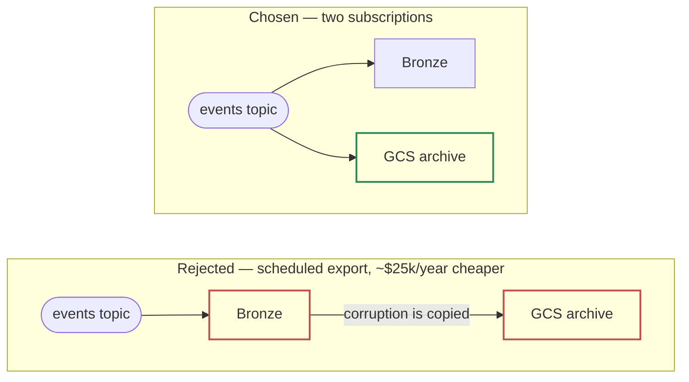

# 1.1 — Six services, two shapes

*Test bullet: propose a GCP architecture diagram, from raw event ingestion to availability for BI.*

What the pipeline must absorb: **2B events/day — \~23,000/second sustained, \~1.5 TB/day raw, \~135 TB across the 90-day Bronze window.**

**Six GCP services — Pub/Sub, Cloud Storage, BigQuery, Dataform, Cloud Logging, Cloud Monitoring — in two shapes.** Everything left of Bronze is Google-operated configuration: one topic, two native export subscriptions, a dead-letter topic. Everything right of Bronze is SQL on a clock. **There is no third shape:** no service we deploy, no runtime we patch, no process of ours that can fail between the publisher and the dashboard. That is the whole architecture, and the rest of Part 1 defends that claim.

## The path, hop by hop

| # | Hop | Mechanism | Latency |
|---|---|---|---|
| 1 | Collector → `events` topic | Publish. The producer splits the envelope: `event_id`, `publisher_id`, `ssp_id`, `event_type` as named fields, everything else under `payload` | seconds |
| 2 | topic → `bronze_events` | **BigQuery export subscription.** Pub/Sub's `publish_time` lands as the row's `ingestion_timestamp`. Google stamps that clock, so no publisher can skew it | seconds |
| 3 | topic → GCS raw archive | **Cloud Storage export subscription.** Archive class from day 0, kept indefinitely. A second subscription, not a copy of Bronze: this copy never passes through BigQuery | seconds |
| 4 | topic → dead-letter topic | A message that fails the topic schema is dead-lettered **alone**; the stream continues. The daily quality job checks queue depth | seconds |
| 5 | Bronze → Silver | **Dataform.** Read the rows newer than the watermark, dedupe on `event_id` with a window function, `MERGE` into `event_day` partitions | every 30 min |
| 6 | Silver → Gold | **Dataform.** Rebuild the days whose Silver rows changed, within a trailing 3-day window | every 4h |
| 7 | Gold → semantic views | BigQuery views. Each metric formula written once, in one place | query time |
| 8 | views → BI, and → the copilot | D-1 dashboards. Part 2's agent reads **the same views**, not its own SQL over the tables | — |
| 9 | Silver → `quality_day` | **Dataform**, on its own tag and schedule. Hourly counts and lateness p99 over the previous day. It judges the data the build path produced | daily |

## What the diagram claims

**1. Two writes from one topic, not one write and a copy.** Bronze and the archive are siblings: the topic feeds both directly. A scheduled export from Bronze to GCS would save \~$25k/year, but it would place the safety copy *downstream* of the system it protects us from. A corrupted write into Bronze would be copied into the archive. Paying the export fee twice is what buys two independent failure domains.

Two arrows out of the topic means two failure domains. One arrow through Bronze means one.

**2. Ingestion holds no state of ours.** No dedup, no join, no aggregation, no validation before Bronze. Everything that can be wrong sits after it, where the repair is a rerun of the same SQL.

**3. One box on the left is not configuration: we had to build it.** Dataform logs every workflow invocation but sends no notification of its own. So Cloud Logging → a log-based alert in Cloud Monitoring → the team's channel is a real box on the diagram, not decoration.

## What pages, beyond "the job failed"

A failed run is the easy alert, and the least interesting one. **Every row below is a way this pipeline can be wrong while every job reports success.**

| Signal | Fires when | The failure it catches that a job-failure alert does not |
|---|---|---|
| Dataform invocation state | any run reports `FAILED` | The baseline. Everything else exists because this alert is not enough |
| **Silver watermark age** | `now − last_success > 90 min` | A run that never *started*: a disabled schedule or a deleted release config raises no error |
| **Bronze arrival rate** | hourly count < 50% of the same hour last week, per publisher | A publisher going quiet is a perfectly healthy pipeline processing nothing |
| **Dead-letter queue depth** | non-zero and rising | Schema violations are dead-lettered *by design*, so nothing downstream fails |
| **Silver rejects rate** | rejects ÷ total past threshold | Typing failures are non-fatal on purpose: they must not stop the run |
| **Dataform assertion** | any `impression` row resolves to a null `publisher_payout` | An expired revenue-share row nulls money silently: the data is complete and wrong |
| **Silver writes outside the Gold window** | a partition older than D-3 changed | Gold rebuilds a trailing 3 days. Data older than that lands correctly in Silver and is **never aggregated** |

That last row is the only place where the cold path can be wrong quietly. It gets an alert, not an assumption.

> **The failure that decides the shape.** A four-hour outage starting Friday at 21:00. What matters is where it sits relative to the durable buffer. Downstream of the buffer — the subscription, the warehouse write, a bad deploy — nothing is lost: the backlog drains, Silver's watermark reads the rows it never saw, the next Gold rebuild repairs the day, **and no human is involved.** Only a failure upstream of the buffer loses data, when their collector cannot publish and has no buffer of its own. That property turns the largest class of incidents from *"manual backfill on Monday"* into *"it fixed itself on Saturday at 01:00"* — a far stronger reason to put a topic there than *"it decouples producers from consumers."*

---

Next: [**1.2 — Three kept, two rejected**](/part_1/02-component-justification.md)
