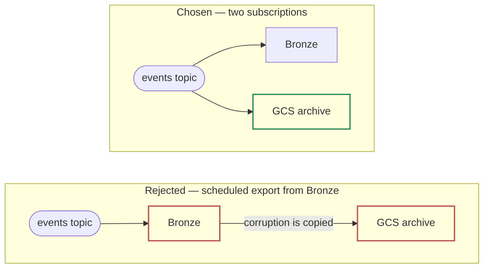

# 1.1 — Architecture Diagram

*Test bullet: propose a GCP architecture diagram, from raw event ingestion to availability for BI.*

What the pipeline must absorb: 2B events/day — \~23,000/second sustained, \~1.5 TB/day raw, \~10.5 TB logical across the 7-day Bronze window (\~3 TB compressed on disk).

Six GCP services — Pub/Sub, Cloud Storage, BigQuery, Dataform, Cloud Logging, Cloud Monitoring — in two shapes. Left of Bronze, Google-operated configuration: one topic, two native export subscriptions, a dead-letter topic. Right of Bronze, SQL on a clock. **There is no third shape: no service we deploy, no runtime we patch, nothing of ours that can fail between publisher and dashboard.**

**The reference architecture for this on GCP puts Dataflow between the topic and the warehouse. That box is absent here, and its absence is the design** — the only work it would do is a field split the producer already performs, and putting it back would place a runtime we operate on the one path where a failure loses data rather than delays it. Argued in full in bullet 1.2, including the condition that brings it back.

## The path, hop by hop

| # | Hop | Mechanism | Latency |
|---|---|---|---|
| 1 | Collector → `events` topic | The producer splits the envelope: `event_id`, `source_id`, `publisher_id`, `ssp_id`, `event_type` and the auction context — including `auction_timestamp` — as named fields on every event; everything else under `payload` | seconds |
| 2 | topic → `bronze_events` | **BigQuery export subscription.** Pub/Sub's `publish_time` lands as `ingestion_timestamp`. Google stamps that clock, so no publisher can skew it | seconds |
| 3 | topic → GCS raw archive | **Cloud Storage export subscription.** Standard class, 7 days. A second subscription, not a copy of Bronze: it never passes through BigQuery | seconds |
| 4 | topic → dead-letter topic | A message failing the topic schema is dead-lettered alone; the stream continues. The quality job checks queue depth | seconds |
| 5 | Bronze → Silver | **Dataform.** Read the rows between the watermark and a ceiling fixed from the data, dedupe on `event_id` with a window function, `MERGE` into `auction_day` partitions | every 30 min |
| 6 | Silver → Gold | **Dataform.** Rebuild the days whose Silver rows changed, within a trailing 3-day window. Hourly grain | hourly |
| 7 | Gold → semantic views | BigQuery views. Each metric formula written once. Daily is a view over the hourly table | query time |
| 8 | views → BI, and → the copilot | Hourly for release monitoring, daily for trend. Part 2's agent reads the same views, not its own SQL over the tables | — |
| 9 | Silver → `quality_hour` | **Dataform**, on its own tag and schedule. It judges the data the build path produced | hourly, plus a daily tier |

## What the diagram claims

1. Two writes from one topic, not one write and a copy. A scheduled export from Bronze to GCS would save the second export fee, but it places the safety copy *downstream* of the system it protects us from.

**Two failure domains instead of one is the archive's only justification:** past day 7 there is no rebuild path, so a copy that has never been inside BigQuery is the only thing that survives a mistake made inside BigQuery.

2. Ingestion holds no state of ours: nothing is deduped, joined, aggregated or validated before Bronze. Everything that can be wrong sits after it, where repair is a rerun of the same SQL.

3. One box on the left is not configuration. Dataform logs every workflow invocation but notifies no one, so Cloud Logging → a log-based alert in Cloud Monitoring → the team's channel is a real box, not decoration.

## What pages, beyond "the job failed"

**Every row below is a way this pipeline can be wrong while every job reports success.**

| Signal | Fires when | The failure it catches that a job-failure alert does not |
|---|---|---|
| Dataform invocation state | any run reports `FAILED` | The baseline. Everything else exists because this alert is not enough |
| Silver watermark age | `now − last_success > 90 min` | A run that never *started*: a disabled schedule or a deleted release config raises no error |
| An elapsed hour with zero events | count = 0 for a closed hour | At 23,000/second an empty hour is a failure, never a lull — no threshold to argue about |
| Dead-letter queue depth | non-zero and rising | Schema violations are dead-lettered *by design*, so nothing downstream fails |
| Silver rejects rate | rejects ÷ total past threshold | Typing failures are non-fatal on purpose: they must not stop the run |
| Dataform assertion | any `impression` row resolves to a null `publisher_payout` | An expired revenue-share row nulls money silently: the data is complete and wrong |
| `event_id` with >1 `auction_timestamp` | non-zero | A producer re-stamping on retry defeats day-scoped dedup. Zero in steady state |
| Silver writes outside the Gold window | a partition older than D-3 changed | Gold rebuilds a trailing 3 days. Data older than that lands correctly in Silver and is never aggregated |

That last row is the only place the cold path can be wrong quietly — an alert, not an assumption.

> **The failure that decides the shape.** A four-hour outage starting Friday at 21:00. What matters is where it sits relative to the durable buffer. Downstream of the buffer — the subscription, the warehouse write, a bad deploy — nothing is lost: the backlog drains, Silver's watermark reads the rows it never saw, the next hourly Gold rebuild repairs the day, and no human is involved. Only a failure upstream of the buffer loses data, when their collector cannot publish and has no buffer of its own. That property turns the largest class of incidents from *"manual backfill on Monday"* into *"it fixed itself on Saturday at 01:00"* — a far stronger reason to put a topic there than *"it decouples producers from consumers."*

---

Next: [**1.2 — Component Justification**](/part_1/02-component-justification.md)
