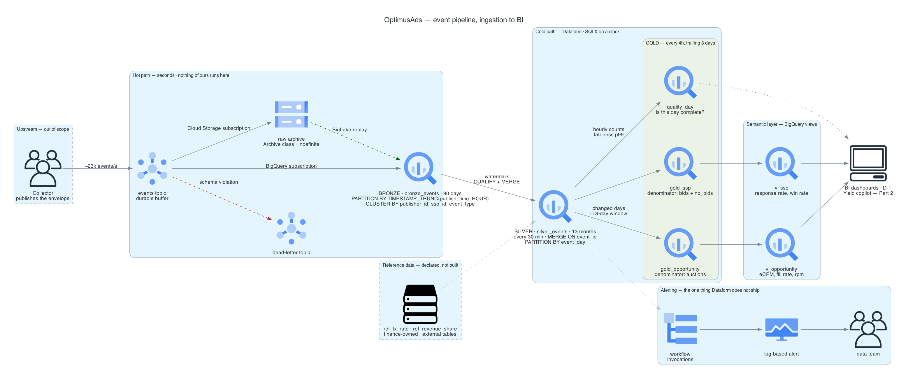

# 1.1 — Propose a GCP architecture diagram, from raw event ingestion to availability for BI

What it has to absorb: **2B events/day — ~23,000/second sustained, ~1.5 TB/day raw, ~135 TB across the 90-day Bronze window, ~40 TB on disk after compression (~3.4:1).**

**Six GCP services — Pub/Sub, Cloud Storage, BigQuery, Dataform, Cloud Logging, Cloud Monitoring — in two shapes.** Everything left of Bronze is Google-operated configuration: one topic, two native export subscriptions, a dead-letter topic. Everything right of Bronze is SQL on a clock. **There is no third shape** — no service we deploy, no runtime we patch, no process of ours that can die between the publisher and the dashboard. That is the whole architecture, and it is the claim the rest of Part 1 defends.

## The path, hop by hop

| # | Hop | Mechanism | Latency |
|---|---|---|---|
| 1 | Collector → `events` topic | Publish. The producer emits the envelope split — `event_id`, `publisher_id`, `ssp_id`, `event_type` as named fields, everything else nested under `payload` | seconds |
| 2 | topic → `bronze_events` | **BigQuery export subscription.** Pub/Sub's `publish_time` lands as the row's `ingestion_timestamp` — a clock Google stamps, which no publisher can skew | seconds |
| 3 | topic → GCS raw archive | **Cloud Storage export subscription.** Archive class from day 0, retained indefinitely. A second subscription, not a copy of Bronze — the point is a failure domain that never routes through BigQuery | seconds |
| 4 | topic → dead-letter topic | A message failing the topic schema is dead-lettered **individually**; the stream continues past it. Queue depth is a check in the daily quality job | seconds |
| 5 | Bronze → Silver | **Dataform.** Read rows past the watermark, dedupe on `event_id` with a window function, `MERGE` into `event_day` partitions | every 30 min |
| 6 | Silver → Gold | **Dataform.** Rebuild the days whose Silver rows changed, within a trailing 3-day window | every 4h |
| 7 | Gold → semantic views | BigQuery views. Each metric formula written once, in one place | query time |
| 8 | views → BI, and → the copilot | D-1 dashboards. Part 2's agent reads **the same views**, not its own SQL over the tables | — |
| 9 | Silver → `quality_day` | **Dataform**, on its own tag and schedule. Hourly counts and lateness p99 over the previous day — it judges the data the build path produced | daily |

## What the picture asserts

**1. Two writes off one topic, not one write and a copy.** Bronze and the archive are siblings, both fed directly by the subscription. Exporting Bronze to GCS on a schedule would be cheaper by ~$25k/year and would put the safety copy *downstream* of the system it exists to be safe from: a corrupting write into Bronze would be faithfully copied into the archive. Paying the export fee twice is what buys two independent failure domains, and it should be named that way rather than defended as incidental.

**2. Ingestion holds no state of ours.** No dedup, no join, no aggregation, no validation before Bronze. Everything that can be wrong — and therefore need redoing — lives after it, where redoing it is a rerun of the same SQL.

**3. The only non-configuration box on the left is one we had to build.** Dataform logs every workflow invocation but ships no notification of its own, so Cloud Logging → a log-based alert in Cloud Monitoring → the team's channel is a real box on the diagram, not decoration. Naming the gap is cheaper than having a reviewer find it.

## What actually pages, and why "the job failed" is not enough

A failed run is the easy alert and the least interesting one. **Every row below is a way this pipeline can be wrong while every job reports success** — which is why the list is a design artefact rather than a checklist.

| Signal | Fires when | The failure it catches that a job-failure alert does not |
|---|---|---|
| Dataform invocation state | any run reports `FAILED` | The baseline. Everything else exists because this one is insufficient |
| **Silver watermark age** | `now − last_success > 90 min` | A run that never *started* — a disabled schedule, a deleted release config — throws no error at all |
| **Bronze arrival rate** | hourly count < 50% of the same hour last week, per publisher | A publisher going quiet is a perfectly healthy pipeline processing nothing |
| **Dead-letter queue depth** | non-zero and rising | Schema violations are dead-lettered *by design*, so nothing downstream fails |
| **Silver rejects rate** | rejects ÷ total past threshold | Typing failures are deliberately non-fatal; the whole point is they do not stop the run |
| **Dataform assertion** | any `impression` row resolves to a null `publisher_payout` | A lapsed revenue-share row nulls money silently — the data is complete and wrong |
| **Silver writes outside the Gold window** | a partition older than D-3 changed | Gold rebuilds a trailing 3 days. Data landing older than that is ingested correctly into Silver and **never aggregated** — the one silent-wrongness path left in the design, so it is alerted rather than trusted |

The last row is the one worth defending out loud: it is the only place where the cold path can be wrong without being loud, so it gets an alert instead of an assumption.

> **The failure that decides the shape.** A four-hour blackout starting Friday at 21:00. Where it sits relative to the durable buffer decides everything. Downstream of it — the subscription, the warehouse write, a bad deploy — nothing is lost: the backlog drains, Silver's watermark picks up rows it never saw, the next Gold rebuild repairs the day, **and no human is involved.** Only an upstream failure, their collector unable to publish with no buffer of its own, genuinely loses data. That single property is what converts the largest class of incidents from *"manual backfill Monday"* into *"it fixed itself Saturday at 01:00"* — and it is a far stronger reason to put a topic there than *"it decouples producers from consumers."*

---

Next: [**1.2 — Justify the chosen components**](/part_1/02-component-justification.md)
