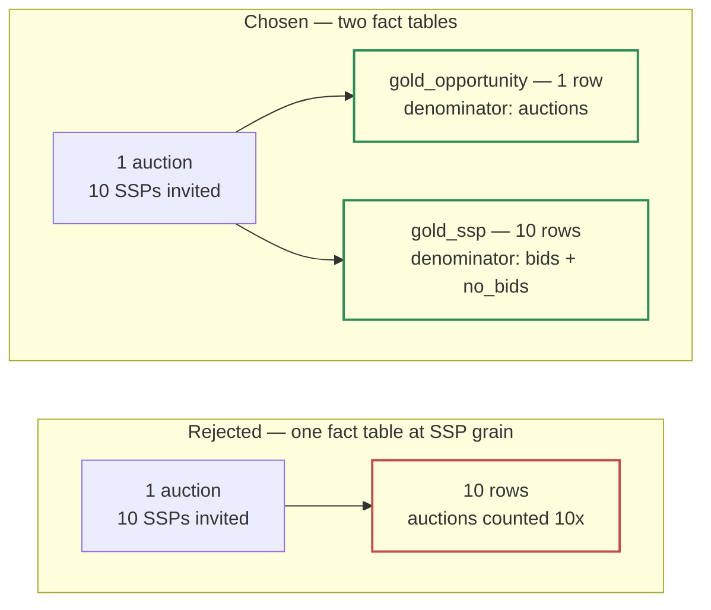

# 2.1 — Three layers, three contracts

*Test bullet: propose a data organization according to the Medallion pattern (Bronze, Silver, Gold).*

Each layer enforces exactly one rule, and that rule decides what may not happen there.

| | **Bronze** | **Silver** | **Gold** |
|---|---|---|---|
| **Rule** | Accepts everything, validates nothing | Types, deduplicates, applies anything that can later change | Aggregates to the grain the business uses for its questions |
| **Grain** | One row per message | One row per event, deduplicated on `event_id` | One row per day × dimensions |
| **Shape** | Typed envelope + opaque `payload` JSON | 16 typed columns, no residual JSON | Two fact tables |
| **Partition / cluster** | `TIMESTAMP_TRUNC(publish_time, HOUR)` / `publisher_id, ssp_id, event_type` | `event_day` / `publisher_id, event_type, ad_unit_id` | `day` / `publisher_id, ad_unit_id` (+ `ssp_id`) |
| **Retention** | 90 days | 13 months | Indefinite |
| **Consumer** | Reprocessing, and the DE team | The DE team, operationally | BI, and the Part 2 copilot — through views |

Retention follows one principle instead of four separate debates: **pay indefinitely for the copy that cannot be recreated, and pay for the shortest useful window for every copy that can.**

- **GCS raw, indefinite** — the only irreplaceable copy. Gold's dimensions are fixed at design time and Silver's schema at transform time, so neither can answer a question about a field that was never typed.
- **Bronze, 90 days** — the reprocessing window, long enough that a live incident is repaired from Bronze rather than from the archive.
- **Silver, 13 months** — covers a year-over-year comparison without a rebuild. A convenience, not a capability, and we can buy it back at any time because Silver is derived.
- **Gold, indefinite — and it is the exception.** It can be recreated, yet we keep it forever: at \~1M rows/day it is four orders of magnitude smaller than the event layers, so its retention is not a cost decision.

## Bronze — accepts everything, validates nothing

A fixed typed header we enforce, plus one JSON column that absorbs whatever else the SSP or the event type sent. **A new SSP field means no schema migration, no dropped events, no pipeline deploy.**

Only STRING columns are promoted out of the payload — `event_id`, `publisher_id`, `ssp_id`, `event_type` — The line falls there for a concrete reason: **a STRING cannot refuse a value.** `NUMERIC price` and `TIMESTAMP event_timestamp` *can* fail on malformed or skewed input, and promoting them would make Bronze validate, which is the next layer's job.

So Bronze rejects nothing that is a well-formed envelope. The only message it can refuse is one that violates the topic schema, and that one is dead-lettered alone, not dropped.

**90 days** is the reprocessing window — long enough that any live incident is repaired from Bronze rather than from the archive.

## Silver — types, deduplicates, enriches

**One table for all five event types.** The dedup `MERGE`, the partitioning and the watermark are identical for `auction`, `bid`, `no_bid`, `win` and `impression`; splitting would multiply three mechanisms by five to save a predicate.

| Column | Type | Note |
|---|---|---|
| `event_id` | STRING | Dedup key |
| `event_type` | STRING | `auction` / `bid` / `no_bid` / `win` / `impression` |
| `event_timestamp` | TIMESTAMP | Producer clock |
| `event_day` | DATE | `DATE(event_timestamp)` — **partition key** |
| `ingestion_timestamp` | TIMESTAMP | Pub/Sub `publish_time`; the `MERGE` tie-break |
| `publisher_id`, `ad_unit_id`, `auction_id` | STRING | `auction_id` ties the event cluster together |
| `ssp_id` | STRING | **Nullable, and only on `auction`** |
| `format`, `device`, `channel` | STRING | display/video/native, device, prebid/direct |
| `price`, `currency` | NUMERIC, STRING | **As reported** |
| `gross_revenue` | NUMERIC | `price` converted to the reporting currency |
| `publisher_payout` | NUMERIC | `gross_revenue` × the publisher's share for that day |

The properties that carry this layer:

**Enrichment from mutable reference data happens here, never at ingest.** Revenue share terms and FX rates are corrected after the fact. A revenue share renegotiated mid-month and applied from the 1st makes every `publisher_payout` of that month wrong, on data that is otherwise *complete and healthy*. Nothing is missing, so no retry and no late-arrival window repairs it. If enrichment happened at ingest, the repair would be a GCS replay, because the raw record would already carry a value computed with the old rate. In Silver, the repair is a transform rerun over a limited set of partitions, and Bronze stays untouched and correct.

**The reference data it uses is declared, not built.** We do not measure `ref_fx_rate` or `ref_revenue_share`. Both are business inputs their owners already maintain: a finance-owned rate table, a contract export. BigQuery reads them as **Drive-backed external tables**, declared in Dataform and reached with `${ref()}` like any other source: no loader, no schedule, nothing to fail. **The FX rate is a finance input, not a data-engineering one, and there is no API to call.** The guardrail is a Dataform assertion: every `impression` row in the days being built must have a non-null `publisher_payout`, so an expired contract row fails the build instead of nulling revenue silently.

**`ssp_id` is nullable, and only for `auction`.** An auction opens before any SSP is involved: in Prebid, `auctionInit` fires at `requestBids()`, and `ssp_id` exists only from `bidResponse`. `NOT NULL` would force a placeholder value that every downstream query must remember. This same fact is what produces two Gold tables below.

**Money is computed on `impression` rows only.** `price` appears on `bid` (the offer), `win` (the clearing price) and `impression` (the clearing price again), but a win that never renders earns nothing. Summing revenue over impressions is the only definition consistent with eCPM's denominator.

Types are enforced at this boundary, which is the whole reason Bronze promoted only STRINGs. Rows that fail typing go to a rejects table with their raw payload attached, instead of failing the run — **one publisher sending garbage must not stop Silver for everyone.**

**Silver keeps no leftover payload**, so its contract is *typed and only typed*. Keeping that JSON would cost about 4× (\~$3,000/month against \~$800), to buy a shorter-lived, partial copy of what GCS already holds indefinitely. Promoting a field later is a SQLX change plus a backfill: from Bronze within 90 days, from the archive after that.

## Gold — two fact tables, two denominators

Daily and dimensioned, not daily totals: the copilot's *"why"* breakdown is only cheap if the dimensions it drills into already exist.

The obvious design is a single table at `day × publisher × ad_unit × ssp × format × device × channel`. **That grain cannot hold `auctions`**, and `auctions` is the denominator of fill rate. An auction carries no `ssp_id`. It does know *which* SSPs were invited, but that is an **array, not a single value**. Using it splits one auction into N rows and multiplies the opportunity count by the number of SSPs invited, 10-20×.



| Table | Grain | Measures |
|---|---|---|
| **`gold_opportunity`** | `day, publisher_id, ad_unit_id, format, device, channel` | `auctions`, `auctions_with_bid`, `responses`, `bids`, `wins`, `impressions`, `gross_revenue`, `publisher_payout` |
| **`gold_ssp`** | `day, publisher_id, ad_unit_id, ssp_id, format, device, channel` | `bids`, `no_bids`, `wins`, `impressions`, `gross_revenue`, `publisher_payout` |

The weak argument for two tables is *"measures at different grains belong in different fact tables"*. It is standard Kimball, and it invites the reply *"then aggregate the SSP dimension away"*. The strong argument: **each table has a denominator the other cannot express.**

| Table | Denominator | The question only it answers |
|---|---|---|
| `gold_opportunity` | `auctions` | *What share of our inventory sold?* — including auctions nobody bid on, which is exactly the unsold inventory the Yield team exists to fix |
| `gold_ssp` | `bids + no_bids` for that SSP | *Of the auctions SSP X was invited to, how often did it respond and win?* — in other words, is X worth keeping |

Every invited SSP produces exactly one response, so `bids + no_bids` is the count of opportunities *that SSP actually saw*.

> **An analyst asks why SSP 7's fill rate looks catastrophic.** It isn't. SSP 7 is invited to 4% of auctions, so measured against every opportunity it looks like it never delivers. Measured against the auctions it was actually invited to, it performs fine. A single fact table keyed by SSP gives only the first number, and the decision that number drives is *"drop SSP 7"*.

**On the duplication:** `wins`, `impressions`, `gross_revenue` and `publisher_payout` appear in both tables. They are a **conformed rollup, not a copy**: summing `gold_ssp` over `ssp_id` reproduces the `gold_opportunity` values exactly, and the same job builds both in the same run from the same Silver rows, so they cannot drift. The alternative moves a correctness risk into every consumer, including a copilot writing its own SQL.

**`auctions_with_bid` must be stored, and the principle matters more than the column:** any count that needs per-event evaluation must be computed during the Gold build. Once rows are aggregated to daily grain, *"how many auctions received zero bids"* cannot be recovered: the aggregation destroyed the information. This is the line between what a semantic layer can define and what Gold must supply.

**The build rule:** every 4 hours, rebuild each day inside a trailing **3-day window** whose Silver rows changed. Frequency and window are two different levers: the frequency buys recovery *speed*, the window buys recovery *reach*. Three days matches the worst realistic detection delay: a Friday failure found on Monday sits at exactly D-3.

## `quality_day` — a third table, beside the two fact tables

**It records whether each day is complete.** It lives in Gold so Part 2's copilot can check whether a day is trustworthy with the access it already has, and needs no exception into Silver.

```sql
CREATE TABLE gold.quality_day (
  day                   DATE,           -- the event day being judged
  publisher_id          STRING,
  events                INT64,          -- Silver rows for that day and publisher
  events_by_hour        ARRAY<INT64>,   -- 24 entries, by HOUR(event_timestamp)
  rejects               INT64,          -- rows diverted to silver_rejects
  lateness_p99_seconds  INT64,          -- p99 of ingestion_timestamp − event_timestamp
  late_beyond_1h        INT64,          -- events exceeding the assumed arrival bound
  restamped_event_ids   INT64,          -- event_ids seen with more than one event_timestamp
  is_complete           BOOL,           -- all 24 hours non-zero and rejects ÷ events under threshold
  computed_at           TIMESTAMP
)
PARTITION BY day
CLUSTER BY publisher_id;
```

**Grain is `day × publisher_id`, not `day`.** *Which* publisher is late, or re-stamping, is the entire actionable content; a daily total names nobody. \~300 rows/day.

| Column | The argument that needs it |
|---|---|
| `events_by_hour` | Completeness. A missing hour is invisible in a daily total |
| `lateness_p99_seconds` | Bullet 2.2's one-hour arrival bound is *measured*, not assumed: the arrival range widens by exactly this |
| `late_beyond_1h` | The count of events that broke that bound, per publisher |
| `restamped_event_ids` | Zero in steady state. Non-zero is the only way to reach bullet 2.3's day-scoped dedup limit |
| `rejects` | The numerator of the Silver rejects-rate alert |
| `is_complete` | One boolean, so the copilot needs no interpretation. The rule lives in the SQLX, not in each consumer |

Three arguments elsewhere in Part 1 end at this table, so it is a deliverable rather than an aside. It holds **no** count of null `publisher_payout`: that one is a Dataform assertion, which *fails the build* instead of recording a number.

## Rejected — one line each

| Option | Why not |
|---|---|
| **A single Gold fact table at SSP grain** | Cannot express `auctions`; forces either a 10-20× opportunity overcount or a placeholder row every query must remember |
| **One Silver table per event type** | Multiplies the `MERGE`, the partitioning and the watermark by five to save a predicate |
| **Residual JSON retained in Silver** | \~4× the storage, to buy a shorter-lived partial copy of what the GCS archive already holds indefinitely |
| **Enrichment applied at ingest** | Turns a backdated revenue-share correction from a bounded transform rerun into a GCS replay |
| **Validation in Bronze** | Makes the landing layer capable of rejecting, which is the one thing it must never do |
| **Deriving `auctions_with_bid` in the view** | The per-event evaluation it needs no longer exists after aggregation |
| **Unconditional rebuild of the whole Gold window** | \~5× the scan, to produce output that is almost always identical. The lever to pull *if* scan cost becomes significant, not now |

---

Next: [**2.2 — Partition by arrival, cluster by publisher**](/part_1/05-bronze-partitioning.md)
