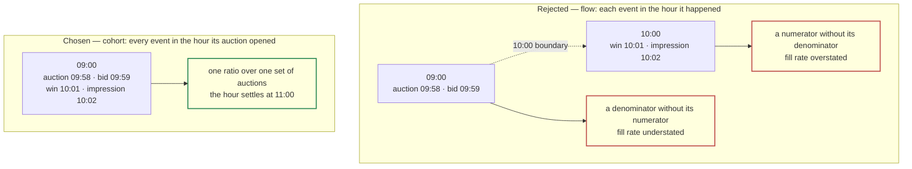
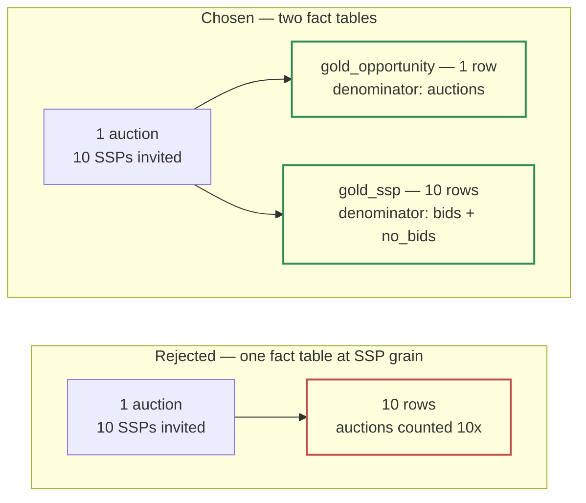

# 2.1 — Medallion Model

*Test bullet: propose a data organization according to the Medallion pattern (Bronze, Silver, Gold).*

Each layer enforces exactly one rule, and that rule decides what may not happen there.

| | **Bronze** | **Silver** | **Gold** |
|---|---|---|---|
| **Rule** | Accepts everything, validates nothing | Types, deduplicates, **anonymises**, applies anything that can later change | Aggregates to the grain the business asks its questions in |
| **Grain** | One row per message | One row per event, deduplicated on `event_id` | One row per **hour** × dimensions |
| **Shape** | Typed envelope + opaque `payload` JSON | \~26 typed columns, no residual JSON | Two fact tables + a quality table |
| **Partition / cluster** | `TIMESTAMP_TRUNC(publish_time, HOUR)` / `publisher_id, ssp_id, event_type` | `auction_day` / `publisher_id, event_type, ad_unit_id` | `DATE(auction_hour)` / `publisher_id, ad_unit_id` (+ `ssp_id`) |
| **Retention** | **7 days** | **Indefinite** | Indefinite |
| **Personal data** | **Yes** — the only layer that holds it | No | No |
| **Consumer** | Reprocessing, and the DE team | The DE team, operationally | BI, and the Part 2 copilot — through views |

Those retention figures come from one principle, argued on the [previous page](/part_1/00-retention-anonymisation.md).

## Bronze — accepts everything, validates nothing

A fixed typed header we enforce, plus one JSON column absorbing whatever else the SSP or the event type sent. **A new SSP field means no schema migration, no dropped events, no pipeline deploy.**

Only STRING columns are promoted out of the payload — `event_id`, `source_id`, `publisher_id`, `ssp_id`, `event_type` — because a STRING cannot refuse a value. `NUMERIC price` and `TIMESTAMP auction_timestamp` *can* fail on malformed input, and promoting them would make Bronze validate, which is the next layer's job. So the only message Bronze can refuse is one violating the topic schema, and that one is dead-lettered alone.

Bronze's opaque payload holds any identifier the collector forwards, so it is the only layer with an expiration set — 7 days, a compliance ceiling rather than a reprocessing budget.

## Silver — types, deduplicates, anonymises

One table for all five event types: the `MERGE`, the partitioning and the watermark are identical, and splitting multiplies three mechanisms by five to save a predicate.

Silver is typed wide, and the retention rule forces it. A narrow Silver is correct when raw is kept forever — anything omitted still sits in the archive. Here omission is permanent at day 7.

> **Type wide, aggregate narrow.**

Every structured non-PII field gets a column whether a metric uses it today or not; Gold stays as narrow as its metrics require. Affordable only because there is no free text — every field is a low-cardinality auction attribute.

| Column | Type | Null? | Note |
|---|---|---|---|
| `event_id` | STRING | no | Dedup key. Envelope |
| `event_type` | STRING | no | `auction` / `bid` / `no_bid` / `win` / `impression` |
| `source_id` | STRING | no | Drives the per-source mapping in 2.3 |
| `publisher_id` | STRING | no | Envelope |
| `ingestion_timestamp` | TIMESTAMP | no | Pub/Sub `publish_time`; the `MERGE` tie-break |
| `auction_timestamp` | TIMESTAMP | no | The auction's clock — identical on all five events |
| `auction_day` | DATE | no | `DATE(auction_timestamp)` — *partition key* |
| `auction_hour` | TIMESTAMP | no | `TIMESTAMP_TRUNC(auction_timestamp, HOUR)` — Gold's grain |
| `job_insert_timestamp` | TIMESTAMP | no | When this pipeline first wrote the row |
| `job_update_timestamp` | TIMESTAMP | no | When it last rewrote it — *Gold's change-detection clock* |
| `auction_id` | STRING | yes | Ties the cluster of events together. Pseudonym; unlinkable from day 8 |
| `event_timestamp` | TIMESTAMP | yes | This event's own clock. For latency, never for bucketing |
| `ad_unit_id` | STRING | yes | |
| `ssp_id` | STRING | yes | Null on `auction` — an auction has no single SSP |
| `format`, `device`, `channel` | STRING | yes | display/video/native · device class · prebid/direct |
| `country`, `placement_position` | STRING | yes | *Typed wide* — no metric uses them today |
| `bid_floor` | NUMERIC | yes | *Typed wide* — the obvious next yield question |
| `deal_id` | STRING | yes | *Typed wide* — programmatic guaranteed vs open auction |
| `is_winner` | BOOL | yes | Null on `auction` |
| `price`, `currency` | NUMERIC, STRING | yes | As reported |
| `gross_revenue` | NUMERIC | yes | `price` converted to the reporting currency |
| `publisher_payout` | NUMERIC | yes | `gross_revenue` × the publisher's share for that day |

Everything read out of an SSP's payload is nullable. Requiring more hands a third party the ability to stop our pipeline: an SSP that never reports `device` is not sending garbage, it simply does not measure device, and a `NOT NULL` there rejects every one of its rows. *Empty, never `'unknown'`, never a default.*

Typing failures produce nulls, not rejected rows: `SAFE_CAST` on a `price` of `"n/a"` yields null, which propagates into a metric that refuses to render. Only a missing `auction_timestamp` diverts the row entirely, to `silver_rejects` — the one field whose absence makes a row unplaceable rather than incomplete.

Enrichment from mutable reference data happens here, never at ingest. A revenue share renegotiated mid-month and backdated to the 1st makes every `publisher_payout` of that month wrong on data that is otherwise healthy, so no retry repairs it. At ingest the fix is a GCS replay; in Silver it is a transform rerun over named partitions.

That reference data is declared, not built: a revenue share is a *contract*, an FX rate a *finance input*, and no company lets data engineering pick the rate that converts revenue. Both are Drive-backed external tables in Dataform — no loader, no schedule, nothing to fail — guarded by an assertion that every `impression` row resolve to a non-null `publisher_payout`. A zero is more dangerous than a failure: it looks like a business result.

Money is computed on `impression` rows only. `price` appears on `bid`, `win` and `impression`, but a win that never renders earns nothing, and summing over impressions is the only definition consistent with eCPM's denominator.

## Gold — hourly stored, daily derived

The client named two aggregations: hourly to watch a release land, daily to follow trends.

| Option | Why not |
|---|---|
| **Two independently built tables** | Two jobs computing the same measures will eventually disagree, and nobody will be able to say which is right |
| **Daily stored, hourly derived** | Impossible in the direction that matters — an hour cannot be recovered from a day |
| **Hourly stored, daily as a view** | **Chosen** |

This is free rather than clever. The semantic layer already requires every stored measure to be additive — counts and sums, never ratios — so views compute rates at any dimensional grain. Additivity over dimensions and additivity over time are the same property, so **a rule adopted so a fill rate could be computed per publisher makes a day the exact sum of its 24 hours.**

### Bucketing: by the auction's hour, not the event's

At daily grain this barely matters. At hourly grain it is the decision the tier rests on: an auction opening at 09:58 with its impression rendering at 10:02 produces events on both sides of a boundary.



Every ratio is wrong in both hours, in opposite directions. Flow's defence is that the errors cancel under steady traffic. A deploy is a step change, the one condition where inflow and outflow are not equal, so **flow breaks precisely in the scenario the hourly tier was requested for.**

So every event counts in the hour its *auction* opened, read from `auction_hour`. Numerator and denominator then describe the same auctions, and a fill rate for 09:00 means *"of the opportunities opened at 09:00, how many filled"*.

### `is_settled` — published by the pipeline, not judged by the reader

Cohort attribution costs one thing: an hour is not final when it closes. So each hour row carries `is_settled` — true once `auction_hour + 2h` has passed *and* the Silver run covering that period has succeeded. Both conditions: the clock can pass while the pipeline is down, and the pipeline can succeed before the window closes.

> **A deploy goes out at 09:50 and someone checks the 10:00 hour at 10:20.** Fill rate looks like it fell off a cliff. Nothing is wrong: auctions opened at 10:15 have not rendered yet. An incomplete hour is indistinguishable from a bad hour, so the pipeline publishes the verdict rather than leaving the reader to guess. Without it, the first thing the hourly tier produces is a rollback of a healthy release.

Each row also carries `sources_total` and `sources_reporting_impressions`. An SSP with no impression beacon contributes real bids and no impressions, which reads as inventory won and never served rather than as a missing measurement — so a metric a source cannot report is `NULL`, never `0`, and `SAFE_DIVIDE` propagates it until the ratio refuses to render.

### Two fact tables, because there are two denominators

The obvious design is one fact table at SSP grain. It cannot hold `auctions`, the denominator of fill rate: an auction opens before any SSP is involved, so it has no single `ssp_id` — it knows *which* SSPs were invited, but that is an array.



| Table | Grain | Measures |
|---|---|---|
| **`gold_opportunity`** | `auction_hour, publisher_id, ad_unit_id, format, device, channel` | `auctions`, `auctions_with_bid`, `responses`, `bids`, `wins`, `impressions`, `gross_revenue`, `publisher_payout` |
| **`gold_ssp`** | `auction_hour, publisher_id, ad_unit_id, ssp_id, format, device, channel` | `bids`, `no_bids`, `wins`, `impressions`, `gross_revenue`, `publisher_payout` |

Both also carry `is_settled` and the two coverage counts, and both partition by `DATE(auction_hour)` — daily partitions holding hourly rows, deliberately: hourly partitions would put 8,760 a year against a 10,000 ceiling on an indefinitely-retained table, and break the atomic day-at-a-time replacement the rebuild depends on.

Each table has a denominator the other cannot express.

| Table | Denominator | The question only it answers |
|---|---|---|
| `gold_opportunity` | `auctions` | *What share of our inventory sold?* — including auctions nobody bid on, which is exactly the unsold inventory the Yield team exists to fix |
| `gold_ssp` | `bids + no_bids` for that SSP | *Of the auctions SSP X was invited to, how often did it respond and win?* — in other words, is X worth keeping |

> **An analyst asks why SSP 7's fill rate looks catastrophic.** It isn't. SSP 7 is invited to 4% of auctions, so measured against every opportunity it looks like it never delivers; measured against the auctions it was invited to, it performs fine. A single fact table keyed by SSP gives only the first number, and the decision that number drives is *"drop SSP 7"*.

`wins`, `impressions`, `gross_revenue` and `publisher_payout` appear in both tables — a conformed rollup, not a copy: summing `gold_ssp` over `ssp_id` reproduces `gold_opportunity` exactly, and one job builds both in the same run from the same rows. Storing them once instead pushes a correctness trap into every consumer, including a copilot writing its own SQL.

`auctions_with_bid` must be stored: once rows are aggregated, *"how many auctions received zero bids"* is unrecoverable. That is the line between what a semantic layer can define and what Gold must supply.

The build rule: every hour, rebuild each day inside a trailing 3-day window whose Silver rows changed. Frequency buys recovery *speed*, the window buys recovery *reach*, and three days matches the worst realistic detection delay — a Friday failure found on Monday sits at exactly D-3.

The cadence is set by *self-healing*, not by freshness: a failed run is repaired by the next one instead of leaving D-1 wrong all day. Freshness demands the same number independently.

**Cost.** The hourly rebuild is \~$450/month, against \~$113 at four-hourly and \~$900 at 30 minutes. Thirty minutes buys nothing: an hourly figure cannot exist before its hour ends.

## `quality_hour` — a third table, beside the two fact tables

It records whether each hour is complete and trustworthy, and lives in Gold so Part 2's copilot can check it with the access it already has.

```sql
CREATE TABLE gold.quality_hour (
  auction_hour              TIMESTAMP,   -- the hour being judged
  publisher_id              STRING,
  events                    INT64,       -- Silver rows for that hour and publisher
  rejects                   INT64,       -- rows diverted to silver_rejects
  lateness_p99_seconds      INT64,       -- p99 of ingestion_timestamp − event_timestamp
  late_beyond_1h            INT64,       -- events that broke the assumed arrival bound
  restamped_event_ids       INT64,       -- event_ids seen with more than one auction_timestamp
  auction_to_impression_p99 INT64,       -- p99 of event_timestamp − auction_timestamp, impressions
  sources_total             INT64,
  sources_reporting         INT64,       -- of those, how many can report this hour's event types
  is_settled                BOOL,        -- auction_hour + 2h passed AND the covering Silver run succeeded
  is_complete               BOOL,        -- events non-zero and rejects ÷ events under threshold
  last_rebuilt_at           TIMESTAMP
)
PARTITION BY DATE(auction_hour);
```

Grain is `auction_hour × publisher_id`: *which* publisher is late, or re-stamping, is the entire actionable content — **a total names nobody.** The daily verdict is a view over this table, for the reason the fact tables work that way: one grain stored, the coarser derived.

| Column | The argument that needs it |
|---|---|
| `lateness_p99_seconds`, `late_beyond_1h` | Bullet 2.2's one-hour arrival bound is *measured*, not assumed. The arrival range widens by exactly this |
| `restamped_event_ids` | Zero in steady state. Non-zero is the only way to reach bullet 2.3's day-scoped dedup limit |
| `auction_to_impression_p99` | The two-hour settlement window is an assumption. Past it, hours are declared settled and then keep changing |
| `sources_reporting` | A metric measured over fewer sources than the slice contains is not comparable with one at full coverage |
| `is_settled`, `is_complete` | Two booleans, so no consumer has to interpret. The rule lives in the SQLX, not in each reader |

It holds no count of null `publisher_payout`: that one is an assertion, which *fails the build* instead of recording a number.

## Rejected — one line each

| Option | Why not |
|---|---|
| **A single Gold fact table at SSP grain** | Cannot express `auctions`; forces either a 10-20× opportunity overcount or a placeholder row every query must remember |
| **Flow attribution — each event in its own hour** | Splits an auction across two buckets, breaking every ratio in both. Its defence fails exactly at a deploy, which is what the hourly tier is for |
| **A self-join on `auction_id` to find the auction hour** | Correct, and a three-day shuffle on every hourly run. Denormalising `auction_timestamp` makes it a column read |
| **Holding unsettled hours back from publication** | Throws away real data to hide incompleteness. `is_settled` labels it instead |
| **Change detection on `ingestion_timestamp`** | Reads a clock Pub/Sub owns, so a row Silver wrote late lands behind Gold's line and its day is never rebuilt — silently, inside the window meant to repair it |
| **One Silver table per event type** | Multiplies the `MERGE`, the partitioning and the watermark by five to save a predicate |
| **Enrichment applied at ingest** | Turns a backdated revenue-share correction from a bounded transform rerun into a GCS replay |
| **Validation in Bronze** | Makes the landing layer capable of rejecting, which is the one thing it must never do |
| **Deriving `auctions_with_bid` in the view** | The per-event evaluation it needs no longer exists after aggregation |
| **Unconditional rebuild of the whole Gold window** | \~5× the scan, to produce output that is almost always identical. The lever to pull *if* scan cost becomes significant, not now |

---

Next: [**2.2 — Bronze Partitioning & Clustering**](/part_1/05-bronze-partitioning.md)
