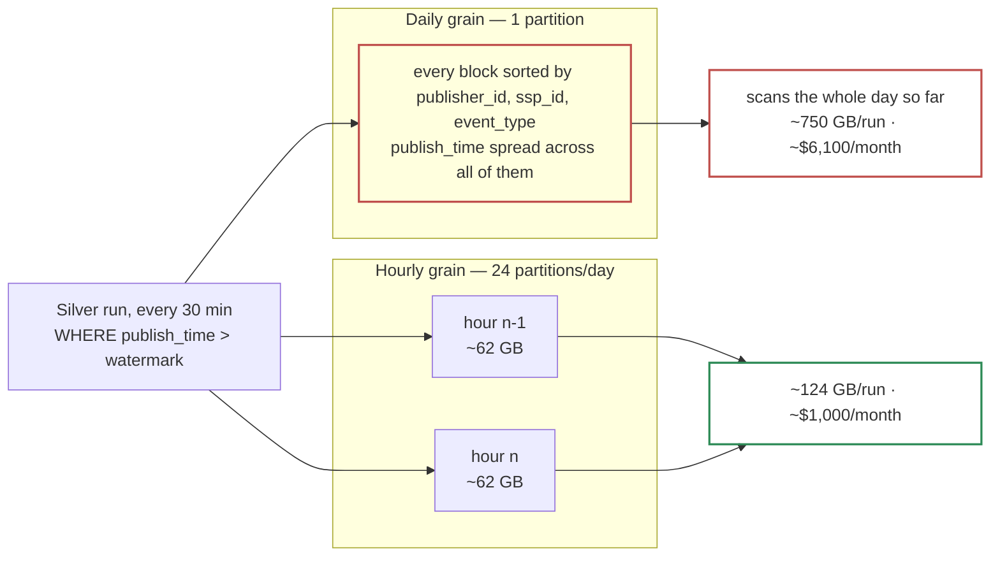

# 2.2 — Partition by arrival, cluster by publisher

*Test bullet: configure partitioning and clustering on the Bronze table to minimize execution cost while keeping queries on `publisher_id`, `ssp_id` and event date fast.*

```sql
CREATE TABLE bronze.bronze_events (
  publish_time  TIMESTAMP,   -- written by the subscription; this design's `ingestion_timestamp`
  event_id      STRING,
  event_type    STRING,
  publisher_id  STRING,
  ssp_id        STRING,
  payload       JSON
)
PARTITION BY TIMESTAMP_TRUNC(publish_time, HOUR)
CLUSTER BY publisher_id, ssp_id, event_type
OPTIONS (
  partition_expiration_days = 90,
  require_partition_filter  = TRUE,
  max_time_travel_hours     = 48
);

ALTER SCHEMA bronze SET OPTIONS (storage_billing_model = 'PHYSICAL');
```

`publish_time` is the metadata column a Pub/Sub BigQuery subscription writes when metadata is enabled. The platform fixes that name; everything downstream reads it as `ingestion_timestamp`.

## Which clock, then which grain

Partitioned on arrival time, as the test asks: pruning by date, at a grain finer than a day. **Two choices need defending: which clock, and which grain.**

### Which clock: arrival, not event time

**`publish_time` is the only clock no publisher can write to.** Pub/Sub stamps it, and Pub/Sub belongs neither to us nor to the producer, so nothing a client sends can change which partition a row lands in.

> **A client has a skewed clock reporting the year 2029.** Because Bronze partitions on arrival, the row lands in the current partition and nothing else notices. Partitioning on the producer's `event_timestamp` would open a partition years in the future, and break two things silently: retention, because that partition never expires on schedule, and pruning, because every scan now covers a range with a hole in it.

There is a second, stronger reason: **`event_timestamp` is not a Bronze column at all.** It sits inside `payload`, unparsed, because a `TIMESTAMP` cast can fail and Bronze is the layer that refuses to validate. Partitioning on it would mean deriving it, and there is no compute between the topic and the table to derive anything.

### Which grain: hourly, not daily

**The dominant Bronze query is not a human's — it is Silver's watermark read, 48 times a day.** `WHERE publish_time > watermark` wants the last 30 minutes of arrivals. At daily grain it prunes to one partition, then scans the whole day accumulated so far, reading `payload` for every `JSON_VALUE`, and `payload` is \~90% of the row width. Averaged over a day, that is \~750 GB per run, \~36 TB/day, **\~$6,100/month**. The `batch_days` DECLARE in bullet 2.3 then issues the same scan a second time.

**Block min/max metadata does not save it, and the reason is our own DDL.** BigQuery's automatic reclustering sorts blocks by the cluster keys, so `CLUSTER BY publisher_id, ssp_id, event_type` spreads `publish_time` across blocks. The clustering the test asked for destroys the arrival order that would have made block pruning work.

An hourly partition is \~62 GB logical. A 30-minute run touches one or two: \~124 GB, \~6 TB/day, **\~$1,000/month.** Same SQL, one DDL line.



Pruning is what the partition grain buys; block pruning is what the clustering spends.

**The limit is far away.** 90 days × 24 = **2,160 partitions**, against BigQuery's limit of 10,000: 4.6× margin. It would only bind past \~416 days of retention, which Bronze will never reach, because Bronze is a reprocessing window and GCS holds the indefinite copy. A separate limit caps a single job at **4,000 partitions modified**; a 90-day replay in one statement touches 2,160, and the replay runbook works day by day (24 partitions) anyway.

**The real cost is for the humans writing queries:** they must filter on a timestamp range instead of `DATE(publish_time) = …`, or pruning will not fire reliably. For a layer whose queries are arrival ranges by nature, as the next section shows, that is the natural shape anyway.

## Event date, answered twice

Two of the three columns the test wants fast are cluster keys. The partition itself answers the third.

**On Bronze, arrival time *is* event date, within one measured hour.** An auction reaches its final state within an hour, and a retry lands at most an hour after the original. So every event whose event date is D arrives between D 00:00 and D+1 01:00: **25 hourly partitions cover a 24-hour day, 4% more than the day itself.** Prune to those 25, then filter `event_timestamp` inside them.

**Hourly grain is what keeps that excess small.** At daily grain the same query needs two partitions to cover one day: 100% more than the day, against 4%.

That one-hour bound is an assumption, and it is the one assumption in the design that measures itself: the daily quality job records lateness p99 per publisher. *"What if lateness is worse than you assumed?"* **The arrival range widens by exactly the measured amount, and nothing else in the design moves.**

**Beyond that, analytical work on event date belongs in Silver**, which is the Medallion pattern the same bullet asks for. Silver partitions on `event_day` = `DATE(event_timestamp)`: typed, deduplicated, and reachable with exactly the filter an analyst would write. **The pipeline has two date columns on purpose, one per job:** Bronze needs a clock no publisher can skew, Silver needs a business meaning that stays stable across retries. Merging them into one is the mistake.

Bronze's own queries are about arrival anyway: *"replay everything that arrived between these two times"*, *"what did publisher X send this morning"*. It is a landing and reprocessing layer, not an analytics one.

## Clustering order is not free

BigQuery clustering is **prefix-ordered**: rows are sorted by the first key, then by the second inside it, and so on. So position 1 goes to the column that is filtered most often and is most selective.

| Position | Key | Why here |
|---|---|---|
| 1 | `publisher_id` | \~300 values, and every operational or reprocessing query names one |
| 2 | `ssp_id` | The test's own second key; the natural filter for a demand-side investigation |
| 3 | `event_type` | 5 values — the biggest bulk filter (`no_bid` is 75-80% of volume) but the coarsest |

**`event_type` is last, even though it removes the most rows.** A clustered column that is not in the prefix still prunes through block min/max metadata: partial pruning, not zero. Putting a 5-value column first would sort every block by the coarsest key available, and weaken the two filters the test named.

## What this costs to query

A query that names an arrival range and a publisher prunes to a few \~62 GB partitions, then to the blocks holding that publisher: a few gigabytes, so a few cents on on-demand pricing. The same query without partitioning would scan **135 TB**. On-demand bills logical bytes, so the smaller compressed size on disk is not what an unpruned scan costs.

**That gap is the whole cost story, and it is why `require_partition_filter = TRUE` is in the DDL:** a `SELECT` against Bronze with no partition filter *fails* instead of scanning 90 days. One line, and the cheapest guardrail in the design — the same protection as the copilot's byte ceiling in Part 2, applied to humans.

Two more options in that DDL are cost decisions rather than defaults:

- **`max_time_travel_hours = 48`** — the minimum. Bronze is immutable and the GCS archive is the recovery path, so a 7-day rollback window is storage we would pay for and never use. This matters *because* of the next line.
- **Physical storage billing.** Billed on compressed bytes at 2× the rate, so it wins whenever compression beats 2:1, which repetitive event JSON clears easily. That turns \~$2,700/month of Bronze storage into \~$1,600. It also bills time-travel and fail-safe bytes, which logical billing does not, hence the 48-hour floor above.

And **`partition_expiration_days = 90` makes retention a table property, not a job.** No deletion to orchestrate, nothing to schedule, nothing to fail, and no purge job with a wrong predicate deleting the wrong partitions. The safest deletion job is the one that does not exist.

## On-demand or a reservation

Every figure above prices **bytes scanned**, which assumes on-demand billing at $6.25/TiB. That assumption is the largest single cost lever in Part 1, so it is stated instead of taken as a default.

The pipeline's whole workload is 48 Silver runs, 6 Gold rebuilds and one quality job a day, plus \~10 analysts: about **\~300 TB scanned/month, \~$1,900 on-demand.**

A BigQuery Editions reservation prices **slot-time** instead, which reverses the arithmetic: a well-pruned 124 GB scan costs $0.76 on-demand, and a fraction of that in slot-seconds. **An autoscaling Standard reservation would probably cost less than on-demand on the pipeline side, and claiming otherwise would be the same mistake as claiming Dataflow costs more.** On-demand wins for two reasons that are not price:

1. **It isolates the Part 2 agent from the pipeline.** Under on-demand, a hallucinated heavy query hits `maximum_bytes_billed` and fails alone. Under a shared reservation it consumes slots and **starves Silver's 30-minute schedule**: the copilot's blast radius stops being a bill and becomes a freshness incident.
2. **Nothing to tune.** A reservation is a baseline, a maximum, an edition and an assignment per workload, and each one drifts as volume grows. The pruning above is what makes on-demand cheap, and that work is already done.

**The threshold to revisit this, stated as a number:** sustained scan above **\~450 TB/month**, where 100 baseline Standard slots (\~$2,900/month) buy the same bytes. Or a second heavy consumer that needs isolation of its own. Neither is close.

One argument for a reservation is about risk, not price: on-demand has no cap, and a query with no partition filter is billable. The DDL already answers it — `require_partition_filter` makes the 135 TB scan **fail instead of bill.**

## Rejected — one line each

| Option | Why not |
|---|---|
| **Partitioning on `event_timestamp`** | Gives the partition key to the producer: one skewed clock opens a partition years in the future and breaks both retention and pruning |
| **Promoting `event_date` as a Bronze column** | Impossible on this path, not a matter of taste: the subscription writes what was published, there is no compute in between, and a `DATE` cast is exactly the failure Bronze must not own |
| **Daily partitioning** | Makes every 30-minute Silver run scan the whole day so far: \~$6,100/month, doubled by the `batch_days` DECLARE. Block pruning cannot save it, because clustering spreads `publish_time` |
| **`event_type` as the first cluster key** | Sorts every block by a 5-value column, and weakens the two keys the test named |
| **No `require_partition_filter`** | Leaves a 135 TB unfiltered scan one typo away |
| **Logical storage billing** | Strictly worse here: \~$1,100/month more for the same bytes |
| **A BigQuery Editions reservation** | Probably cheaper on the pipeline side, but it shares slots with the Part 2 agent, which turns a hallucinated query from a failed bill into a freshness incident. Revisit above \~450 TB/month |
| **A scheduled purge job** | Partition expiration does the same, with no code, no schedule, and no `DELETE` with a wrong predicate |

---

Next: [**2.3 — Dedup that survives reruns**](/part_1/06-dedup-sql.md)
