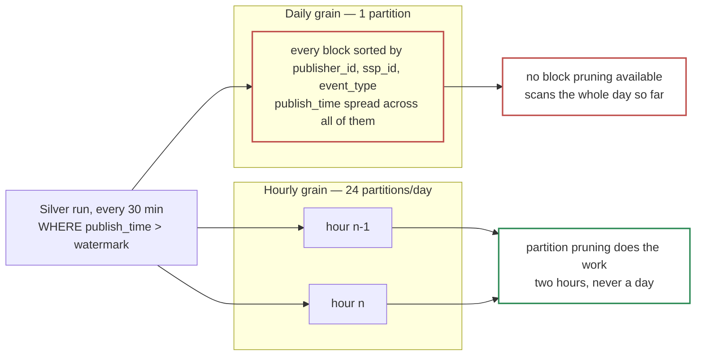

# 2.2 — Bronze Partitioning & Clustering

*Test bullet: configure partitioning and clustering on the Bronze table to minimize execution cost while keeping queries on `publisher_id`, `ssp_id` and event date fast.*

```sql
CREATE TABLE bronze.bronze_events (
  publish_time  TIMESTAMP,   -- written by the subscription; this design's `ingestion_timestamp`
  event_id      STRING,
  source_id     STRING,
  event_type    STRING,
  publisher_id  STRING,
  ssp_id        STRING,
  payload       JSON
)
PARTITION BY TIMESTAMP_TRUNC(publish_time, HOUR)
CLUSTER BY publisher_id, ssp_id, event_type
OPTIONS (
  partition_expiration_days = 7,     -- compliance ceiling, not a cost target
  require_partition_filter  = TRUE,
  max_time_travel_hours     = 48
);

ALTER SCHEMA bronze SET OPTIONS (storage_billing_model = 'PHYSICAL');
```

`publish_time` is the metadata column the Pub/Sub subscription writes. The platform fixes that name; everything downstream reads it as `ingestion_timestamp`.

Partitioned on date, as the test asks, at a grain finer than a day. Two choices need defending: **which clock, and which grain.**

## Which clock: arrival, not event time

`publish_time` is the only clock no publisher can write to. Pub/Sub stamps it, and Pub/Sub belongs neither to us nor to the producer.

> **A client has a skewed clock reporting the year 2029.** Because Bronze partitions on arrival, the row lands in the current partition and nothing else notices. Partitioning on the producer's clock would open a partition years in the future, and break two things silently: retention, because that partition never expires on schedule, and pruning, because every scan now covers a range with a hole in it.

A second reason: the producer's timestamps are not Bronze columns at all. They sit unparsed inside `payload`, because a `TIMESTAMP` cast can fail, and there is no compute between the topic and the table to derive one.

## Which grain: hourly, not daily

Daily is the reflex reading of *"partitioned by date"*. The column does not change — only the grain, and the dominant query decides it.

**The dominant Bronze query is not a human's — it is Silver's watermark read, 48 times a day.** `WHERE publish_time > watermark` wants the last 30 minutes of arrivals. At daily grain it prunes to one partition, then scans everything accumulated inside it — including `payload`, \~90% of the row width. At 02:00 the day is nearly empty; at 23:30 the run reads most of \~1.5 TB to find thirty minutes of rows.

Block min/max metadata does not save it, and the reason is our own DDL: automatic reclustering sorts blocks by the cluster keys, so `CLUSTER BY publisher_id, ssp_id, event_type` *scatters* `publish_time` across them. The clustering the test asked for destroys the arrival order block pruning would need, which leaves partition grain as the only lever.

| Bronze grain | Silver's read, per run | × 48 runs/day | Scan cost |
|---|---|---|---|
| **DAY** | \~750 GB (day average) | \~36 TB/day | **\~$6,100/month** |
| **HOUR** | \~124 GB | \~6 TB/day | **\~$1,000/month** |



Both figures double, because the `batch_days` DECLARE in bullet 2.3 issues the same scan a second time. \~$10,000/month of difference on one clause of DDL — four times the second export subscription that bullet 1.2 argues at length.

> Retention does not touch this figure. A 7-day window puts Bronze *storage* at \~$140/month against \~$1,600 at 90 days, but the scan cost above is per-run: retention drives storage, partition grain drives compute, and compute is the larger number.

The partition limit is not a consideration: 7 days × 24 = 168 partitions against a ceiling of 10,000.

The real cost falls on humans writing queries. `WHERE DATE(publish_time) = '2026-08-23'` does not prune reliably, so an ad-hoc query needs a timestamp range instead — a papercut, paid so the query that runs 48 times a day is six times cheaper.

## Event date, answered twice

Two of the three columns the test wants fast are cluster keys. The partition answers the third.

**On Bronze, arrival time *is* event date, within one measured hour.** An auction reaches its final state within an hour and a retry lands at most an hour after the original, so every event whose date is D arrives between D 00:00 and D+1 01:00: 25 hourly partitions cover a 24-hour day, 4% more than the day itself. At daily grain the same query needs two partitions — 100% more. The one-hour bound is measured hourly and per publisher, so if lateness worsens the arrival range widens by exactly the measured amount and nothing else moves.

Beyond that, analytical work on event date belongs in Silver — the Medallion pattern the same bullet asks for. Silver partitions on `auction_day` = `DATE(auction_timestamp)`: typed, deduplicated, and reachable with exactly the filter an analyst would write. Two date columns, one per job: Bronze needs a clock no publisher can skew, Silver a business meaning stable across every event of one auction.

## Clustering order is not free

BigQuery clustering is *prefix-ordered*: rows are sorted by the first key, then by the second inside it. Position 1 goes to the column filtered most often and most selectively.

| Position | Key | Why here |
|---|---|---|
| 1 | `publisher_id` | \~300 values, and every operational or reprocessing query names one |
| 2 | `ssp_id` | The test's own second key; the natural filter for a demand-side investigation |
| 3 | `event_type` | 5 values — the biggest bulk filter (`no_bid` is 75-80% of volume) but the coarsest |

**`event_type` is last, even though it removes the most rows.** A clustered column outside the prefix still prunes through block min/max metadata — partial, not zero. Putting a 5-value column first would sort every block by the coarsest key there is, weakening the two filters the test named.

## What this costs to query

A query naming an arrival range and a publisher prunes to a few \~62 GB partitions, then to the blocks holding that publisher: a few gigabytes, a few cents. Without a partition filter the same query scans 10.5 TB, the whole window — which is why `require_partition_filter = TRUE` is in the DDL: it *fails* instead of scanning seven days.

**Bronze is not where that setting earns its keep — Silver is.** Bronze's worst case is bounded at 10.5 TB by the expiration; Silver has no expiration at all, so it is the one table where an unqualified `SELECT` scans something that grows forever. Silver sets the same option, and every query this design runs against it already names its partitions.

`max_time_travel_hours = 48` is the minimum: Bronze is immutable, the GCS archive is the recovery path, and the 7-day default would pay to keep a rollback of data we are obliged to delete.

`partition_expiration_days = 7` makes retention a table property, not a job: nothing to schedule, nothing to fail, no purge job with a wrong predicate. Under a compliance obligation, *"show me your deletion process"* is answered by six words of table options, enforced by the storage engine.

## On-demand or a reservation

Every figure above prices bytes scanned, at on-demand $6.25/TiB. The whole workload — 48 Silver runs, 24 Gold rebuilds and the quality job a day, plus \~10 analysts — is \~360 TB/month, \~$2,250. A reservation prices slot-time instead, and an autoscaling Standard reservation would probably cost less.

**On-demand wins on two things that are not price.** It isolates the Part 2 agent: a hallucinated heavy query hits `maximum_bytes_billed` and fails alone, where under a shared reservation it consumes slots and starves Silver's 30-minute schedule, turning the copilot's blast radius from a bill into a freshness incident. And there is nothing to tune: a reservation needs a baseline, a maximum, an edition and an assignment per workload, each drifting as volume grows.

Revisit above \~450 TB/month sustained, where 100 baseline Standard slots (\~$2,900/month) buy the same bytes.

## Rejected — one line each

| Option | Why not |
|---|---|
| **Partitioning on the producer's timestamp** | Gives the partition key to the producer: one skewed clock opens a partition years in the future and breaks both retention and pruning |
| **Promoting `event_date` as a Bronze column** | Impossible on this path: the subscription writes what was published, there is no compute in between, and a `DATE` cast is exactly the failure Bronze must not own |
| **Daily partitioning** | Every 30-minute Silver run scans the whole day so far: \~$6,100/month, doubled by the `batch_days` DECLARE. Block pruning cannot save it, because clustering spreads `publish_time` |
| **`event_type` as the first cluster key** | Sorts every block by a 5-value column, weakening the two keys the test named |
| **No `require_partition_filter`** | Leaves a 10.5 TB unfiltered scan one typo away on Bronze — and an unbounded one on Silver |
| **Logical storage billing** | The data compresses \~3.4:1, far past the 2:1 break-even, and logical roughly doubles the Silver bill, which is the one that grows |
| **A BigQuery Editions reservation** | Probably cheaper on the pipeline side, but shares slots with the Part 2 agent: a hallucinated query becomes a freshness incident instead of a failed bill. Revisit above \~450 TB/month |
| **A scheduled purge job** | Partition expiration does the same with no code and no schedule — and under a legal obligation, no possibility of being quietly paused |

---

Next: [**2.3 — Deduplication, Bronze → Silver**](/part_1/06-dedup-sql.md)
