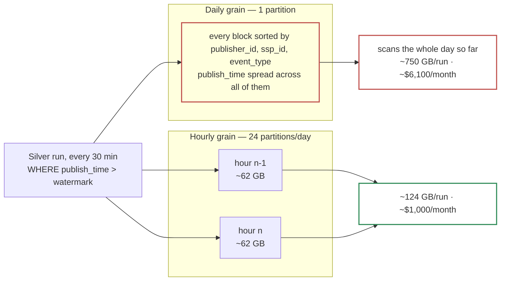

# 2.2 — Bronze Partitioning & Clustering

*Test bullet: configure partitioning and clustering on the Bronze table to minimize execution cost while keeping queries on `publisher_id`, `ssp_id` and event date fast.*

```sql
CREATE TABLE bronze.bronze_events (
  publish_time  TIMESTAMP,   -- written by the subscription; this design's `ingestion_timestamp`
  event_id      STRING,
  source_id     STRING,
  event_type    STRING,
  publisher_id  STRING,
  ssp_id        STRING,
  payload       JSON
)
PARTITION BY TIMESTAMP_TRUNC(publish_time, HOUR)
CLUSTER BY publisher_id, ssp_id, event_type
OPTIONS (
  partition_expiration_days = 7,     -- compliance ceiling, not a cost target
  require_partition_filter  = TRUE,
  max_time_travel_hours     = 48
);

ALTER SCHEMA bronze SET OPTIONS (storage_billing_model = 'PHYSICAL');
```

`publish_time` is the metadata column a Pub/Sub BigQuery subscription writes when metadata is enabled. The platform fixes that name; everything downstream reads it as `ingestion_timestamp`.

Partitioned on date, as the test asks, at a grain finer than a day. **Two choices need defending: which clock, and which grain.**

## Which clock: arrival, not event time

**`publish_time` is the only clock no publisher can write to.** Pub/Sub stamps it, and Pub/Sub belongs neither to us nor to the producer, so nothing a client sends can change which partition a row lands in.

> **A client has a skewed clock reporting the year 2029.** Because Bronze partitions on arrival, the row lands in the current partition and nothing else notices. Partitioning on the producer's clock would open a partition years in the future, and break two things silently: retention, because that partition never expires on schedule, and pruning, because every scan now covers a range with a hole in it.

There is a second, stronger reason: **the producer's timestamps are not Bronze columns at all.** They sit inside `payload`, unparsed, because a `TIMESTAMP` cast can fail and Bronze refuses to validate. Partitioning on one would mean deriving it, and there is no compute between the topic and the table.

## Which grain: hourly, not daily

The test says *"partitioned by date"*, and daily is the reflex reading of it. The *column* does not change; only the grain does, and the dominant query is what decides it.

**The dominant Bronze query is not a human's — it is Silver's watermark read, 48 times a day.** `WHERE publish_time > watermark` wants the last 30 minutes of arrivals. At daily grain it prunes to one partition and then scans everything accumulated inside it, reading `payload` for every JSON path — and `payload` is ~90% of the row width. At 02:00 the day is nearly empty; at 23:30 the run reads most of ~1.5 TB to find thirty minutes of rows.

**Block min/max metadata does not save it, and the reason is our own DDL.** BigQuery's automatic reclustering sorts blocks by the cluster keys, so `CLUSTER BY publisher_id, ssp_id, event_type` *scatters* `publish_time` across blocks. The clustering the test asked for destroys the arrival order that would have made block pruning work. Once clustering is fixed, partition grain is the only lever left.

| Bronze grain | Silver's read, per run | × 48 runs/day | Scan cost |
|---|---|---|---|
| **DAY** | ~750 GB (day average) | ~36 TB/day | **~$6,100/month** |
| **HOUR** | ~124 GB | ~6 TB/day | **~$1,000/month** |



Both figures double, because the `batch_days` DECLARE in bullet 2.3 issues the same scan a second time. **~$10,000/month of difference, on one clause of DDL** — four times the second export subscription that bullet 1.2 argues at length.

> **The retention change did not touch this figure, and that is why it is here.** Bronze's *storage* fell from ~$1,600/month to ~$140 when the window went from 90 days to 7. This scan cost did not move at all, because it is per-run. **Retention drives storage; partition grain drives compute; and the compute number is the larger one.** Cutting retention by 92% saved less than choosing the right grain does.

**The partition limit is not a consideration:** 7 days × 24 = **168 partitions** against a ceiling of 10,000. Worth a sentence only because *"hourly partitioning hits the partition limit"* is the reflex challenge.

**The real cost is for humans writing queries.** `WHERE DATE(publish_time) = '2026-08-23'` does not prune reliably, so an ad-hoc query needs a timestamp range instead — a genuine papercut, paid so the query that runs 48 times a day is six times cheaper.

## Event date, answered twice

Two of the three columns the test wants fast are cluster keys. The partition answers the third.

**On Bronze, arrival time *is* event date, within one measured hour.** An auction reaches its final state within an hour and a retry lands at most an hour after the original, so every event whose date is D arrives between D 00:00 and D+1 01:00: **25 hourly partitions cover a 24-hour day, 4% more than the day itself.** At daily grain the same query needs two partitions — 100% more, against 4%. That one-hour bound is the one assumption in the design that measures itself, hourly and per publisher: *"what if lateness is worse than you assumed?"* — **the arrival range widens by exactly the measured amount, and nothing else moves.**

**Beyond that, analytical work on event date belongs in Silver**, which is the Medallion pattern the same bullet asks for. Silver partitions on `auction_day` = `DATE(auction_timestamp)`: typed, deduplicated, and reachable with exactly the filter an analyst would write. **The pipeline has two date columns on purpose, one per job:** Bronze needs a clock no publisher can skew, Silver needs a business meaning stable across retries and across every event of one auction.

## Clustering order is not free

BigQuery clustering is **prefix-ordered**: rows are sorted by the first key, then by the second inside it. So position 1 goes to the column filtered most often and most selectively.

| Position | Key | Why here |
|---|---|---|
| 1 | `publisher_id` | \~300 values, and every operational or reprocessing query names one |
| 2 | `ssp_id` | The test's own second key; the natural filter for a demand-side investigation |
| 3 | `event_type` | 5 values — the biggest bulk filter (`no_bid` is 75-80% of volume) but the coarsest |

**`event_type` is last, even though it removes the most rows.** A clustered column outside the prefix still prunes through block min/max metadata — partial, not zero. Putting a 5-value column first would sort every block by the coarsest key available and weaken the two filters the test named.

## What this costs to query

A query naming an arrival range and a publisher prunes to a few ~62 GB partitions, then to the blocks holding that publisher: a few gigabytes, so a few cents. The same query with no partition filter would scan **10.5 TB** — the whole window. **That is why `require_partition_filter = TRUE` is in the DDL:** it *fails* instead of scanning seven days.

**But Bronze is not where that setting earns its keep — Silver is.** Bronze's worst case is bounded at 10.5 TB by the expiration. **Silver has no expiration at all**, so it is the one table where an unqualified `SELECT` scans something that grows forever with no ceiling to hit. Silver sets the same option, and nothing of ours changes: every query this design runs against Silver already names its partitions.

Two more options are cost decisions rather than defaults. **`max_time_travel_hours = 48`** is the minimum: Bronze is immutable and the GCS archive is the recovery path, and at the 7-day default time travel would span the *entire* retention window — paying to store a rollback capability covering data we are obliged to delete. **Physical storage billing** bills compressed bytes at 2× the rate, so it wins past 2:1 compression; Bronze is a ~$140/month table now, so it is Silver where the setting pays.

And **`partition_expiration_days = 7` makes retention a table property, not a job.** Nothing to schedule, nothing to fail, no purge job with a wrong predicate. **Under a compliance obligation this stops being an elegance argument:** *"show me your deletion process"* is answered by six words of table options, enforced by the storage engine and impossible to pause by pausing a scheduler.

## On-demand or a reservation

Every figure above prices **bytes scanned**, which assumes on-demand at $6.25/TiB — the largest single cost lever in Part 1, so it is stated rather than defaulted into. The whole workload is 48 Silver runs, 24 Gold rebuilds and the quality job a day, plus ~10 analysts: **~360 TB/month, ~$2,250.**

A reservation prices **slot-time** instead, which reverses the arithmetic. **An autoscaling Standard reservation would probably cost less, and claiming otherwise would be the same mistake as claiming Dataflow costs more.** On-demand wins on two things that are not price:

1. **It isolates the Part 2 agent.** Under on-demand, a hallucinated heavy query hits `maximum_bytes_billed` and fails alone. Under a shared reservation it consumes slots and **starves Silver's 30-minute schedule** — the copilot's blast radius stops being a bill and becomes a freshness incident.
2. **Nothing to tune.** A reservation is a baseline, a maximum, an edition and an assignment per workload, each drifting as volume grows. The pruning above is what makes on-demand cheap, and that work is done.

**The threshold to revisit, as a number:** sustained scan above **\~450 TB/month**, where 100 baseline Standard slots (\~$2,900/month) buy the same bytes. **The margin narrowed from 150 TB to 90 TB when the cadence went hourly**, so it is a figure to watch rather than a settled one. The one argument for a reservation that is about risk rather than price is already answered: `require_partition_filter` makes the unbounded scan **fail instead of bill**.

## Rejected — one line each

| Option | Why not |
|---|---|
| **Partitioning on the producer's timestamp** | Gives the partition key to the producer: one skewed clock opens a partition years in the future and breaks both retention and pruning |
| **Promoting `event_date` as a Bronze column** | Impossible on this path, not a matter of taste: the subscription writes what was published, there is no compute in between, and a `DATE` cast is exactly the failure Bronze must not own |
| **Daily partitioning** | Makes every 30-minute Silver run scan the whole day so far: \~$6,100/month, doubled by the `batch_days` DECLARE. Block pruning cannot save it, because clustering spreads `publish_time` |
| **`event_type` as the first cluster key** | Sorts every block by a 5-value column, and weakens the two keys the test named |
| **No `require_partition_filter`** | Leaves a 10.5 TB unfiltered scan one typo away on Bronze — and an unbounded one on Silver |
| **Logical storage billing** | Strictly worse: the data compresses ~3.4:1, far past the 2:1 break-even, and it roughly doubles the Silver bill, which is the one that grows |
| **A BigQuery Editions reservation** | Probably cheaper on the pipeline side, but it shares slots with the Part 2 agent, turning a hallucinated query from a failed bill into a freshness incident. Revisit above \~450 TB/month |
| **A scheduled purge job** | Partition expiration does the same with no code and no schedule — and under a legal obligation, no possibility of being quietly paused |

---

Next: [**2.3 — Deduplication, Bronze → Silver**](/part_1/06-dedup-sql.md)
