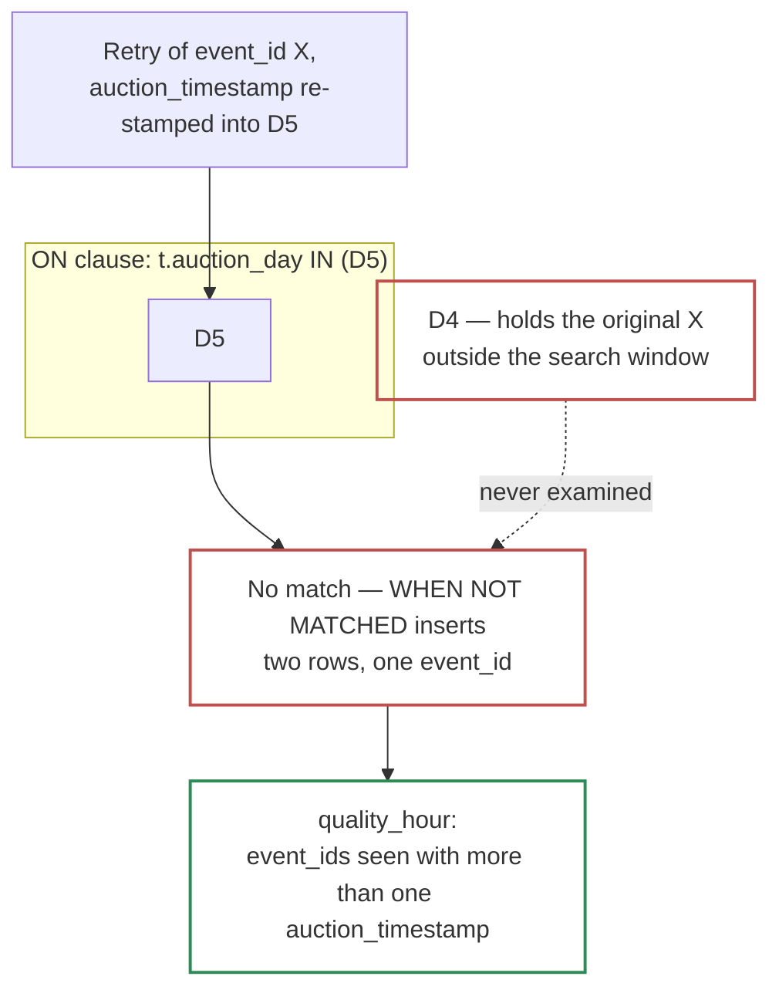

# 2.3 — Deduplication, Bronze → Silver

*Test bullet: write the SQL query (using a window function) to deduplicate events arriving with the same `event_id` during the Bronze → Silver transition.*

The window function, as asked. Six lines:

```sql
SELECT * EXCEPT (publish_time), publish_time AS ingestion_timestamp
FROM bronze_events
WHERE publish_time > @watermark AND publish_time <= @batch_max   -- the partition filter
QUALIFY ROW_NUMBER() OVER (
          PARTITION BY event_id
          ORDER BY publish_time DESC
        ) = 1
```

`QUALIFY` filters on a window function without the `SELECT ... FROM (…) WHERE rn = 1` wrapper. `ORDER BY publish_time DESC` keeps the **last** copy — both directions are defensible, and keeping the last makes this tie-break identical to the one the `MERGE` below applies, so the rule is written once and holds everywhere. **The filter must name `publish_time`, not the alias**: it is the partitioning column, and `require_partition_filter` is watching. Silver renames it to `ingestion_timestamp` once, here.

## Alone, it dedups only the batch

**Duplicates arrive up to an hour late, and Silver runs every 30 minutes, so a duplicate and its original usually land in *different runs*.** The window function sees one batch only: in the common case it finds nothing to remove and inserts a row Silver already holds. Silver counts twice, Gold sums it, and the dashboard is quietly wrong. Removing duplicates **against what is already in Silver** takes a `MERGE ON event_id`.

That does not make the window function optional. **BigQuery rejects a `MERGE` whose source contains duplicate keys:** `UPDATE/MERGE must match at most one source row for each target row`. So the two are not alternatives — **the window function makes the `MERGE` legal, and the `MERGE` makes the dedup correct.**

## One model, not one per source

Payloads differ by source, and converging them is a stated objective. So the typing step cannot be one JSON path per field: `price` lives at `$.bid.cpm` for one SSP and `$.price_usd` for another.

| Option | Why not |
|---|---|
| **Push convergence to the producers** | The right answer when it is available, and it is not: the SSPs are third parties. We can demand an *envelope format* from our own collector; we cannot demand *field semantics* from them |
| **One SQLX model per source, unioned** | Correct output, and the `MERGE`, the watermark, the rejects boundary and the assertions get copy-pasted N times. A fix to dedup has to land in every copy, and the fifth one gets missed |
| **One model, a declarative mapping, expanded at compile time** | **Chosen** |

The mapping is a JavaScript object in the Dataform repository, expanded into `CASE source_id` branches **at compile time**. Nothing evaluates it at runtime; BigQuery receives ordinary SQL.

```js
// includes/sources.js — the whole source contract, in one reviewable file
const SOURCES = {
  ssp_alpha: {
    fields: { auction_timestamp: "$.auction.ts",  price: "$.bid.cpm",   currency: "$.bid.cur" },
    emits:  ["auction", "bid", "no_bid", "win", "impression"]
  },
  ssp_beta: {
    fields: { auction_timestamp: "$.t_auction",   price: "$.price_usd", currency: null },
    emits:  ["auction", "bid", "win"]            // no impression beacon at all
  }
};

// Expands to one CASE per column. A source with no path for a field yields NULL — never zero.
const col = (name, type) => `CASE source_id\n` + Object.entries(SOURCES).map(([s, c]) =>
  c.fields[name]
    ? `  WHEN '${s}' THEN SAFE_CAST(JSON_VALUE(payload, '${c.fields[name]}') AS ${type})`
    : `  WHEN '${s}' THEN NULL`
).join("\n") + `\nEND`;
```

> **Why this is worth the cleverness, in one line:** *the runtime SQL is identical to the hand-written version, so we pay no execution cost and take no execution risk — what we buy is that adding a source is a data change instead of a code change.*

**Onboarding an SSP becomes a reviewable diff of the thing that actually varies** — the dedup, the enrichment, the rejects boundary and the assertions are untouched, so an onboarding cannot break them. It also makes convergence auditable: *"which sources report a bid floor?"* is one file, not five models.

**The retreat, stated up front, because *"this is over-engineered"* is the fair challenge.** Delete the helper and paste the generated `CASE` blocks into the model. The compiled SQL, the cost and the results are unchanged; we lose auditability and gain nothing. **The fallback is free, which is the test of whether an abstraction is safe to add.**

`emits` is the second half of the mapping, and it exists for a worse failure than a missing column: an SSP with no impression beacon shows real bids against **zero** impressions, which reads as inventory won and never served rather than as a gap. So a metric a source cannot report is `NULL`, never `0`, and Gold carries the coverage counts from bullet 2.1.

## What actually runs

```sql
DECLARE watermark TIMESTAMP DEFAULT (
  SELECT last_success FROM pipeline_state WHERE model = 'silver_events'
);

-- The batch's upper bound. Read from the data, fixed for the whole run, so the three
-- statements below see one batch instead of three snapshots of a growing table.
DECLARE batch_max TIMESTAMP DEFAULT (
  SELECT MAX(publish_time) FROM bronze_events WHERE publish_time > watermark
);

-- The auction days present in this batch. Exact, not assumed — drives the pruning below.
DECLARE batch_days ARRAY<DATE> DEFAULT (
  SELECT ARRAY_AGG(DISTINCT DATE(${col("auction_timestamp", "TIMESTAMP")}) IGNORE NULLS)
  FROM bronze_events
  WHERE publish_time > watermark AND publish_time <= batch_max
);

MERGE INTO silver_events AS t
USING (
  WITH deduped AS (
    SELECT * EXCEPT (publish_time), publish_time AS ingestion_timestamp
    FROM bronze_events
    WHERE publish_time > watermark AND publish_time <= batch_max
    QUALIFY ROW_NUMBER() OVER (
              PARTITION BY event_id
              ORDER BY publish_time DESC
            ) = 1
  ),
  -- Every JSON path below is generated from includes/sources.js at compile time.
  -- A source that does not send a field yields NULL here, never a default.
  typed AS (
    SELECT
      event_id, event_type, ingestion_timestamp, publisher_id, ssp_id, source_id,
      ${col("auction_timestamp", "TIMESTAMP")} AS auction_timestamp,
      ${col("event_timestamp",   "TIMESTAMP")} AS event_timestamp,
      ${col("auction_id",        "STRING")}    AS auction_id,
      ${col("ad_unit_id",        "STRING")}    AS ad_unit_id,
      ${col("format",            "STRING")}    AS format,
      ${col("device",            "STRING")}    AS device,
      ${col("channel",           "STRING")}    AS channel,
      ${col("country",           "STRING")}    AS country,
      ${col("placement_position","STRING")}    AS placement_position,
      ${col("deal_id",           "STRING")}    AS deal_id,
      ${col("bid_floor",         "NUMERIC")}   AS bid_floor,
      ${col("is_winner",         "BOOL")}      AS is_winner,
      ${col("price",             "NUMERIC")}   AS price,
      ${col("currency",          "STRING")}    AS currency
    FROM deduped
  )
  SELECT
    y.* EXCEPT (price, currency),
    DATE(y.auction_timestamp)                    AS auction_day,
    TIMESTAMP_TRUNC(y.auction_timestamp, HOUR)   AS auction_hour,
    y.price, y.currency,
    IF(y.event_type = 'impression', y.price * fx.rate,                      NULL) AS gross_revenue,
    IF(y.event_type = 'impression', y.price * fx.rate * rs.publisher_share, NULL) AS publisher_payout,
    CURRENT_TIMESTAMP() AS job_insert_timestamp,   -- kept on UPDATE, set on INSERT
    CURRENT_TIMESTAMP() AS job_update_timestamp    -- rewritten on both
  FROM typed y
  LEFT JOIN ref_fx_rate fx                     -- finance-owned, declared external table
    ON  fx.currency = y.currency
    AND fx.day      = DATE(y.auction_timestamp)
  LEFT JOIN ref_revenue_share rs               -- contract export, declared external table
    ON  rs.publisher_id = y.publisher_id
    AND DATE(y.auction_timestamp) BETWEEN rs.valid_from AND rs.valid_to
  WHERE y.auction_timestamp IS NOT NULL        -- typing failures divert to the rejects table
) AS s
ON  t.event_id    = s.event_id
AND t.auction_day IN UNNEST(batch_days)        -- 1-2 partitions, never the whole table
WHEN MATCHED AND s.ingestion_timestamp > t.ingestion_timestamp THEN UPDATE SET
  event_type = s.event_type, event_timestamp = s.event_timestamp,
  auction_hour = s.auction_hour, ingestion_timestamp = s.ingestion_timestamp,
  source_id = s.source_id, publisher_id = s.publisher_id, ad_unit_id = s.ad_unit_id,
  auction_id = s.auction_id, ssp_id = s.ssp_id,
  format = s.format, device = s.device, channel = s.channel,
  country = s.country, placement_position = s.placement_position,
  deal_id = s.deal_id, bid_floor = s.bid_floor, is_winner = s.is_winner,
  price = s.price, currency = s.currency,
  gross_revenue = s.gross_revenue, publisher_payout = s.publisher_payout,
  job_update_timestamp = s.job_update_timestamp   -- job_insert_timestamp is NOT reset
WHEN NOT MATCHED THEN INSERT ROW;
```

## Five choices worth pointing at

**Every read is bounded above by `batch_max`, not only below by the watermark.** Bronze grows while the run executes, so an open-ended predicate means the three statements read three different tables. The upper bound makes them one batch, and stops the watermark advancing past rows the `MERGE` never saw.

**`t.auction_day IN UNNEST(batch_days)` sits in the `ON` clause, not in a subquery.** That line *is* the partition pruning. Put it anywhere BigQuery cannot evaluate before the scan and pruning stops silently: results stay correct, only the bill changes. Silver has no expiration, so the unpruned alternative scans a table that grows forever.

**`batch_days` is read from the data, not assumed to be "today and yesterday".** A backfill three days old targets its own partition automatically; a hardcoded window would scan the wrong partitions *and* miss the duplicates it was meant to catch.

**`auction_day` is absent from the `UPDATE SET` on purpose.** A duplicate whose auction day moved is not a duplicate — it is the producer re-stamping on retry while reusing `event_id`. Updating the column would move the row to another partition and hide that bug, so it stays out and the anomaly stays visible to the quality job. `auction_hour` *is* updated, because it derives from a value that should never have changed.

**`SAFE_CAST` plus `WHERE y.auction_timestamp IS NOT NULL` is the rejects boundary.** A companion `INSERT` writes the excluded rows with their raw payload to `silver_rejects`. **That table carries a 7-day expiration**, because it holds raw payloads and therefore sits on the wrong side of the anonymisation boundary.

## A watermark, saved two minutes behind the ceiling

`WHERE publish_time > watermark` reads every Bronze row ingested since the last **successful** run. A fixed lookback, say 3 hours, has no catch-up mode: a backlog draining on Sunday arrives outside every following window and is skipped for good. The watermark states the rule more simply — *process everything not yet processed* — so a two-day backlog runs the same code as a two-minute one.

This is safe **because `publish_time` is stamped by the platform**. But *stamped in order* and *appear in order* are different claims, and only the first is true:

> **A message stamped 10:29:58 becomes queryable at 10:30:04.** The subscription writes Bronze in parallel, so the order rows are *stamped* is not the order they *appear*. The 10:30 Silver run had already read; the highest stamp it saw was 10:29:59. Had that become the new line, the 10:29:58 row would have sat behind it forever — merged by nothing, counted by nothing, and no job would have failed.

So the line is saved **two minutes behind `batch_max`**, and every run re-reads the last two minutes of the previous one. **The `MERGE` throws the repeats away — that is the job it already does** — so the overlap costs scan and nothing else: ~7% of the Bronze read. *Failure has to land in the direction of doing work twice, never in the direction of skipping it.*

The watermark lives in a table, `pipeline_state`, one row per model — not in a `SELECT MAX(...) FROM ${self()}`. That `MAX` is over a non-partitioned column on a table with `require_partition_filter = TRUE`, so **BigQuery refuses to run it**, and a row makes the watermark *settable*: *"reprocess from Tuesday"* is an `UPDATE` rather than a code change.

## Day-scoped dedup is a trade, not an oversight

`t.auction_day IN UNNEST(batch_days)` is what makes the `MERGE` cheap. It is also what limits it:

1. Silver holds `event_id = X` at `auction_day = D4`
2. The producer retries X and re-stamps the auction clock into D5. `batch_days = [D5]`
3. The `ON` clause looks for X **in D5 only**, finds nothing, and `WHEN NOT MATCHED` inserts it



**Moving to the auction's clock made this rarer, and made the alternative worse.** Re-stamping `event_timestamp` on retry is plausible producer behaviour — the beacon fires again, "now" is a new value. Re-stamping `auction_timestamp` means altering an attribute the producer is *carrying* rather than *generating*, which is a considerably stranger bug. Meanwhile, closing the gap inside the `MERGE` means dropping the partition filter and matching every run against the entire history of Silver — a table with **no expiration**, so that scan grows without bound and would be paid 48 times a day forever, to defend against a bug in someone else's code.

So it is closed by **detection instead of prevention**: the quality job counts the `event_id`s appearing with more than one `auction_timestamp`. Zero in steady state; non-zero means a producer is re-stamping, and the repair is a targeted rebuild of the two days involved. **The rule the whole design runs on: being wrong must be visible and rerunnable, not impossible.** A limit we have priced and instrumented is not the same as one we did not notice.

## Midnight is not an edge case — it is impossible

The obvious question: an event at 23:59:59 whose duplicate arrives after midnight. Do they land in different partitions and miss each other?

No, and under `auction_day` the case cannot arise. `auction_timestamp` is identical on all five events of an auction by construction, so **an auction cannot straddle midnight no matter when its impression fires.** Partitioning on each event's own clock would make midnight merely *survivable*; the auction's clock removes the case.

## Rejected — one line each

| Option | Why not |
|---|---|
| **Window function alone** | Limited to one batch. The duplicate usually arrives in a later run than the original, so in the common case it removes nothing |
| **`MERGE` alone, no window function** | Illegal: BigQuery refuses a source with duplicate keys, `UPDATE/MERGE must match at most one source row for each target row` |
| **`SELECT DISTINCT` / `GROUP BY event_id`** | No tie-break rule, and no way to express "keep the later copy" |
| **`ORDER BY publish_time ASC` (keep first)** | Defensible, but then the batch rule and the `MERGE` rule disagree, and that disagreement only shows on a row that arrived twice |
| **A wall-clock ceiling — `CURRENT_TIMESTAMP()` at the start of the run** | Simpler, and wrong: a message stamped before the ceiling can surface after it and land behind the line. A ceiling read from the data is a value we have seen; a clock reading is a prediction |
| **Dataform's native incremental model** | `SELECT MAX(ingestion_timestamp) FROM ${self()}` is refused outright by `require_partition_filter`, and it makes the watermark unsettable for a backfill |
| **Dedup at ingest, before Bronze** | Needs \~10 GB of live keyed state on the hot path to hold a 1h window at 23k/s, and lets duplicates through *silently* when that state is lost, where the `MERGE` fails loudly and can be rerun |
| **A fixed 3h read window** | No catch-up: a draining backlog is skipped for good, and only the numbers show it |
| **Partition filter in a subquery instead of the `ON` clause** | Same results, no pruning: the failure is invisible except on the bill |
| **Dropping the partition filter to make dedup day-independent** | Matches every 30-minute run against a table with no expiration, to prevent a producer bug the quality job already reports |
| **`CAST` instead of `SAFE_CAST`** | One malformed value fails the whole run instead of one row |
| **One SQLX model per source** | Copy-pastes the `MERGE`, the watermark and the assertions N times, so a dedup fix has to land in every copy |

---

Part 1 complete. Next: [**Part 2 — LLM Agent**](/part2-llm-agent.md)
