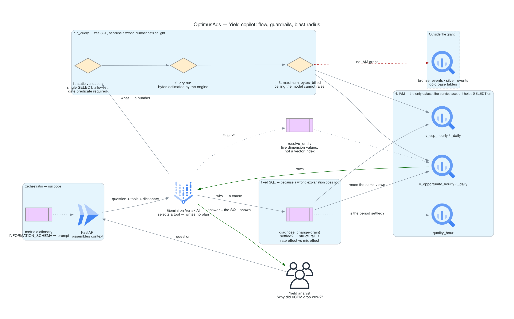

# 1.2 — User → Orchestrator → Model → BigQuery

*Test bullet: detail the flow between the user, the orchestrator (e.g., LangChain or FastAPI), the model (Vertex AI / Gemini), and the BigQuery database (Text-to-SQL + RAG pattern).*

## The flow, hop by hop

One stateless `POST` per question, and a loop that runs at most twice: the model names a tool, our code executes it, the result goes back, the model narrates. **Everything the model produces passes through code we own before it reaches BigQuery.**

| # | Hop | Mechanism | Latency |
|---|---|---|---|
| 1 | Analyst → FastAPI on Cloud Run | One `POST` per question, stateless — no session store, no state to invalidate | — |
| 2 | FastAPI assembles context | The metric dictionary, generated from `INFORMATION_SCHEMA` and injected whole, plus four `FunctionDeclaration`s and a `tool_config` | ms |
| 3 | FastAPI → Gemini on Vertex AI | `client.models.generate_content(model=…, contents=…, config=GenerateContentConfig(tools=[…], tool_config=…))` | ~1–2 s |
| 4 | Gemini → tool call | A name and arguments on `response.function_calls` — the model chooses *what* to ask, and writes no SQL on three of the four tools | — |
| 5 | Validator | `run_query` only: parse, single `SELECT`, allowlist, mandatory date predicate — our code, ahead of the client | ms |
| 6 | Dry run | `run_query` only: bytes-to-be-scanned returned by the engine without executing | < 1 s |
| 7 | Execute against the semantic views | **Every** job carries `maximum_bytes_billed`, the fixed routines included — they take model-chosen arguments even though we wrote their SQL; the service account holds `SELECT` on the semantic-layer dataset alone | 1–3 s |
| 8 | Result → model | `Part.from_function_response(...)` appended to `contents`; the loop returns to hop 3 | ms |
| 9 | Narration → FastAPI → analyst | Four fields on the same `POST`: the prose, the executed SQL, the rows, and the period's quality verdict | ~1–2 s |

## Orchestrator — own loop, not LangChain

The test offers *"LangChain or FastAPI"*. Those are not alternatives: LangChain is a framework, FastAPI is the HTTP layer. **The real choice is LangChain inside FastAPI against our own loop inside FastAPI** — that loop is hops 3 to 8, about fifty lines against one provider.

LangChain v1 shipped 2025-10-22 and `create_agent` runs on the LangGraph runtime; its `wrap_tool_call` middleware receives a tool call *before* execution, and returning a `ToolMessage` without invoking `handler` rejects it. **So LangChain can hold the guardrail seam**; claiming otherwise is a strawman.

**The objection is a dependency one.** We own the seam either way; one of the two ways is a framework whose agent entry point moved packages inside a year — `AgentExecutor` now ships in a separate `langchain-classic` package, `create_agent` is the supported path. This is the argument that removed Dataflow, Composer and dbt Core in Part 1, and Cube and a vector database alongside LangChain in Part 2: *a runtime we operate, placed between us and something we could call directly.*

## The model call, concretely

The SDK is the **Google Gen AI SDK** (`google-genai`) — `genai.Client(vertexai=True, project=…, location=…)`. Not the Vertex AI SDK: `vertexai.generative_models` was deprecated 2025-06-24 and **removed 2026-06-24** — and Google's own *"Forced function calling"* sample still uses the removed API, so a live Google sample copied today ships dead code.

Pass Python callables to the SDK and it enables *automatic function calling*: the SDK executes the function itself, up to `maximum_remote_calls` (default 10) — nowhere to put hops 5 to 7. So tools are declared as `FunctionDeclaration`s and `automatic_function_calling=AutomaticFunctionCallingConfig(disable=True)` is set explicitly. **That one flag is the difference between a guarded executor and a model calling BigQuery directly.**

Parallel function calling — several calls in one turn, no documented flag to disable it — means every call is answered before hop 3 runs again.

**No model ID is pinned:** Flash tier, function calling, a 12-month availability class. IDs churn — `gemini-2.5-flash` retires 2026-10-20.

## Text-to-SQL + RAG, located in the flow

**Text-to-SQL is hop 4 into hops 5 to 7.** `run_query` carries the only model-written SQL, and the only objects it may name are the semantic views — enforced by the allowlist at hop 5 and the grant at hop 7.

**RAG is two mechanisms here, not one.** The metric dictionary is retrieved at hop 2 from `INFORMATION_SCHEMA` and injected whole, because it fits. Entity names are resolved by `resolve_entity` against live dimension values in Gold — a tool call, not an index. Its SQL is ours, so hops 5 and 6 do not apply to it. Section 2.2 argues why neither is a vector store.

**The four guardrail layers sit at hops 5 to 7** — static validation, dry run, `maximum_bytes_billed`, IAM — argued in section 3.

**Cost.** BigQuery bytes dominate per question, not tokens, and the ceiling at hop 7 bounds the worst case, not the average. Context caching is not a lever: the minimum cacheable prefix for the Gemini 3 family is 4,096 tokens, below which the dictionary block sits.

## Build vs buy — build: the API can't force the guardrail

Google's Conversational Analytics API went **GA for BigQuery on 2026-06-23** and now carries most of this page: `big_query_max_billed_bytes`, IAM scoping, custom BigQuery routines registered as `user_functions.bqRoutines`, and semantically matched example queries. That closes most of the gap; two things survive.

**Nothing makes the routine mandatory.** The docs say a registered routine is used *"if they're needed"* and that a matched example query *"might"* be executed; our loop's `mode = ANY` with `allowed_function_names` (1.1) removes the choice. No mechanism for forcing it is documented, and every steering primitive the docs describe is advisory. Removing model choice on the uncatchable question class is the design; an agent product sells the opposite.

**Table selection is documented as not being a security control.** Verbatim: *"Table selection isn't a security setting. Even if you specify that the data source can only pull information from certain tables — like table1 and table2 — the system might still return data from an unintended table (table3) if the user running the query has general permissions."* The test asks how a hallucination is stopped from reading terabytes of raw data. The product documents that its scoping does not answer that; hop 7's service account does.

Buying wins for an organisation without an engineer to own a prompt-and-validator stack. Not here — they are hiring the engineer.

## Rejected — one line each

| Option | Why not |
|---|---|
| **Vertex AI Agent Runtime** (ex Agent Engine) | Managed hosting, sessions and memory for a stateless single-turn call with four tools; also pins the service to Python |
| **Google ADK** | The same objection one layer closer to Google: a framework above a call we make in one line |
| **Looker + LookML**, even already in place | Its agent is documented as not supporting correlation questions — the test's own example. And reaching LookML from our loop means the Open SQL Interface: `SELECT` only, no `JOIN`, and the job runs on Looker's connection, leaving nothing of ours to carry the dry run, the ceiling or the grant |
| **Streaming model tokens to the user** | The answer is checkable only once the SQL and numbers arrive with it; a streamed narration is read before either exists |
| **A custom web UI for the ten analysts** | A fifth component in a four-participant flow, serving a cross-check the four response fields already carry |

---

Next: [**2.1 — Metrics & Business Glossary**](/part_2/03-semantic-layer.md)
